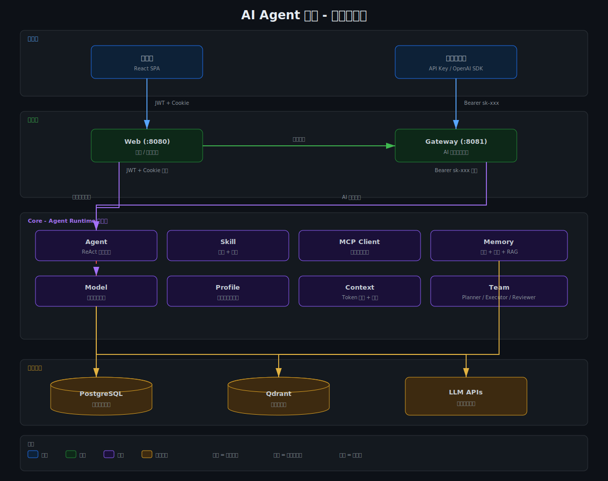
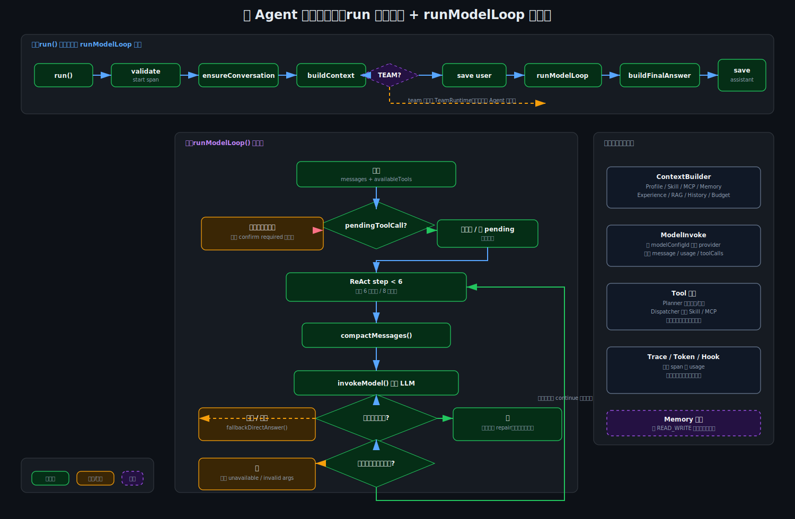
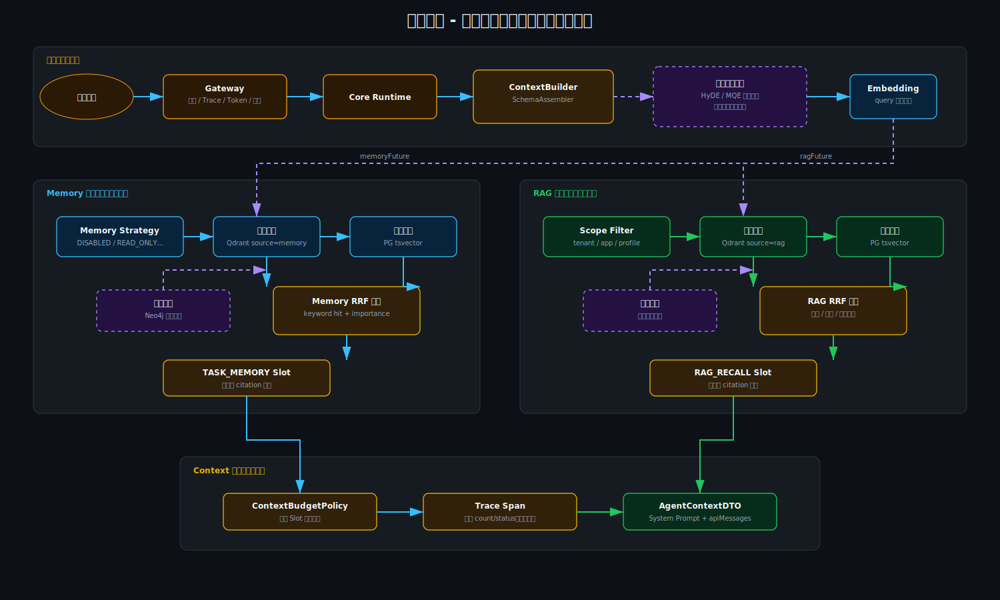
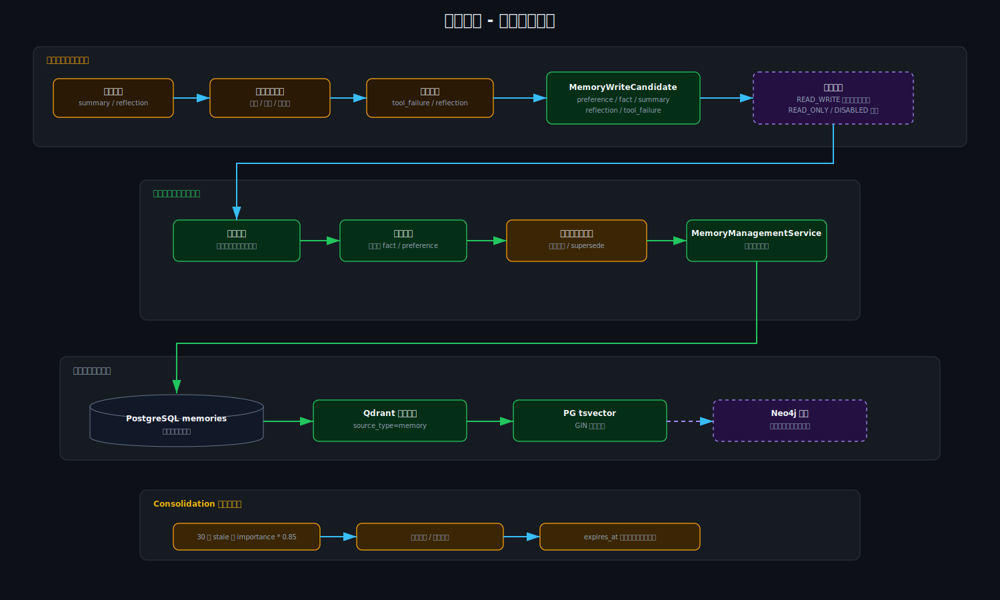
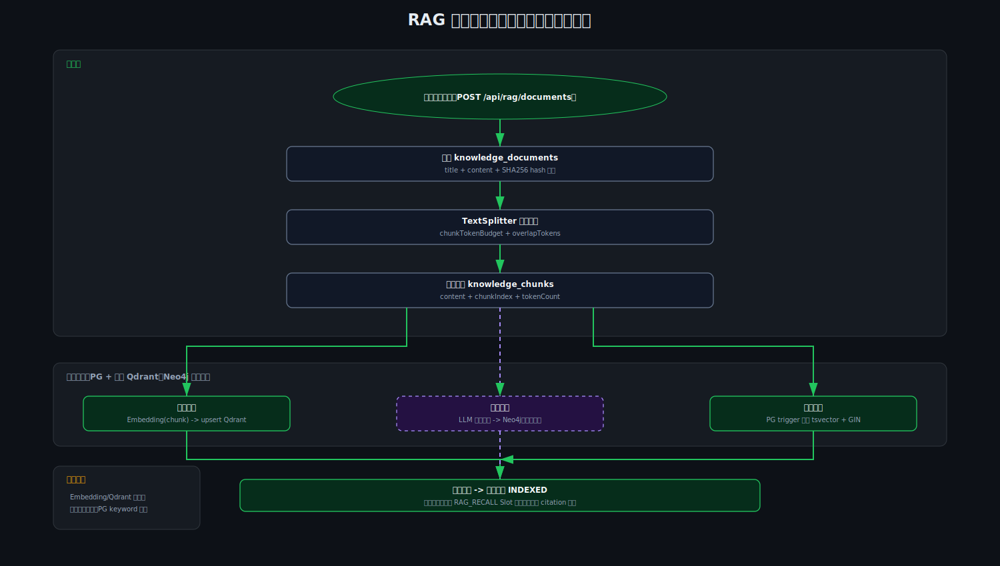

# Agent Platform

蓝山最终考核项目：企业级 AI Agent 分发平台。

本项目实现了一个以 Spring Boot 为核心的 Agent 平台，包含 Web 控制台、Gateway 治理入口、Agent Runtime、Skill/MCP 工具、长期记忆、RAG 知识库、Trace 和 Token 配额能力；LangGraph4j 与基础 Team Agent 编排能力标记为待完成。前端使用 React + Vite + TypeScript，后端使用 Maven 多模块工程。

## 架构与核心流程图

### 系统架构



### 单 Agent 核心流程



### 记忆系统与 RAG 流程







## 当前定位

项目按考核目标拆成两条主线：

| 主线 | 说明 |
|---|---|
| 项目 1：Agent 平台 | 用户登录、Application/API Key、Agent Profile、Skill/MCP、ReAct 执行、记忆、RAG、对话历史、前端控制台 |
| 项目 3：AI Infra Gateway | AI 调用入口治理、API Key 鉴权、Trace、Token 配额、敏感数据处理、告警记录 |

飞书机器人按设计是独立服务，本仓库当前主要实现 Agent 平台与 Gateway 侧能力。

## 技术栈

| 层 | 技术 |
|---|---|
| 后端 | Spring Boot 3.4.13, Java 17 |
| 构建 | Maven 多模块 |
| ORM | MyBatis-Plus 3.5.12 |
| 数据库 | PostgreSQL 16, Flyway |
| 向量库 | Qdrant 1.12.6 |
| 权限 | Spring Security, JWT, API Key |
| 模型调用 | Spring AI 与 OpenAI 兼容 Provider 封装 |
| 前端 | React 19, Vite 8, TypeScript, Tailwind CSS |
| UI | Radix UI, lucide-react, ECharts |
| 测试 | JUnit, ArchUnit, Vitest |
| 部署 | Docker Compose, Nginx |

## 模块结构

```text
agent-platform/
├─ agent-platform-common/      公共错误码、异常、工具类
├─ agent-platform-core/        核心业务：identity、model、profile、skill、mcp、agent、memory、rag、trace、quota、team
├─ agent-platform-web/         Web 控制台后端：JWT 鉴权、管理 API、浏览器对话转发
├─ agent-platform-gateway/     AI 调用治理入口：API Key 鉴权、Trace、Quota、敏感数据、告警
├─ agent-platform-frontend/    React 控制台
├─ data/                       本地运行数据目录
├─ docs/                       运行或交付补充文档
├─ scripts/                    辅助脚本
├─ 考核设计/                    需求、架构、接口、数据库等设计文档
├─ 实际开发/                    阶段开发记录、优化设计、验收材料
├─ docker-compose.yml          完整容器化启动
├─ docker-compose.dev.yml      仅启动 PostgreSQL 和 Qdrant
└─ pom.xml                     Maven 父 POM
```

后端模块依赖方向：

```text
web/gateway -> core -> common
```

`web` 和 `gateway` 作为入口层，不直接拥有核心业务表。核心业务表归 `core` 内部逻辑包管理。

## 核心能力

### 身份与权限

- 用户注册、登录、JWT 鉴权
- Admin/User/Developer 等角色基础数据
- Application 管理
- API Key 绑定 Application，明文只在生成或重置时返回
- API Key 用于 Gateway AI 调用入口鉴权

默认种子用户：

```text
username: admin
password: admin123
```

### Agent Runtime

- Profile 驱动的单 Agent 执行
- 自研 ReAct 循环，不依赖 LangChain 工作流
- 支持 Skill 与 MCP Tool 合并进入运行时上下文
- 支持工具调用事件、观察结果、最终答案和 SSE 输出
- 支持高危工具确认的 pending tool call 流程
- 支持 `agent`、`none` 两种运行模式，`team` 模式待完成

### Skill 与 MCP

- 内置 Skill：calculator、weather、search
- 支持配置型 Skill 与 Jar Skill 上传入口
- 支持经验型 Skill
- MCP Client 支持 stdio 与 HTTP 示例链路
- 示例 MCP 数据由 Flyway seed 初始化

### 记忆与 RAG

- 对话消息持久化
- 长期记忆表 `memories`
- 记忆策略：`DISABLED`、`READ_ONLY`、`READ_WRITE`、`SESSION_ONLY`
- summary、preference、reflection、tool_failure 等记忆类型
- RAG 文档入库、切分、PG 存储
- Qdrant 向量索引，默认 collection 为 `rag_chunks`
- PG tsvector 倒排检索
- 查询增强、HyDE、reranker、semantic cache 等增强能力按配置启用

当前未实现或仍属于后续规划的能力：

- Neo4j 图谱召回
- LLM NER 异步实体关系抽取
- 完整 OpenAI `/v1/chat/completions` 路由兼容层
- 独立飞书机器人完整指令体系
- LangGraph4j 集成
- Team Agent 编排链路

### Gateway 治理

- API Key 鉴权
- Trace Root 与 Span 记录
- Token 配额预扣、提交、释放
- 敏感数据扫描
- 告警事件记录
- 浏览器 Web 请求通过内部 token 转发到 Gateway

当前 Gateway 实际 AI 入口：

| 入口 | 路径 | 鉴权 | 用途 |
|---|---|---|---|
| Web 内部转发 | `POST /internal/ai/chat/stream` | `X-Internal-Token` | Web 后端调用 Gateway |
| API Key 调用 | `POST /api/ai/chat/stream` | `Authorization: Bearer sk-...` | 外部开发者调用 Gateway |
| Web 浏览器调用 | `POST /api/chat/stream` | JWT | 前端通过 Web 后端发起对话 |

### 前端控制台

前端位于 `agent-platform-frontend/`，主要页面包括：

- 登录/注册
- Dashboard
- 对话页
- Application/API Key 管理
- Model Provider/Model Config 管理
- Agent Profile 管理
- Skill/MCP/Memory/RAG 管理
- Trace 列表与详情
- Token 用量统计
- Admin 管理占位页面

## 快速启动

### 前置要求

- JDK 17+
- Maven 3.9+
- Node.js 18+
- Docker Desktop 或 Docker Compose

Windows 环境建议使用 PowerShell。

### 方式一：本地开发启动

1. 启动基础设施：

```powershell
docker compose -f docker-compose.dev.yml up -d
```

这会启动：

- PostgreSQL: `localhost:15432`
- Qdrant: `localhost:6333`

2. 启动 Web 服务：

```powershell
mvn.cmd -pl agent-platform-web -am spring-boot:run
```

Web 默认端口：`8080`

3. 启动 Gateway 服务：

```powershell
mvn.cmd -pl agent-platform-gateway -am spring-boot:run
```

Gateway 默认端口：`8081`

4. 启动前端：

```powershell
cd agent-platform-frontend
npm install
npm run dev
```

前端默认地址：

```text
http://127.0.0.1:5173
```

登录：

```text
admin / admin123
```

### 方式二：Docker Compose 完整启动

复制环境变量文件：

```powershell
Copy-Item .env.example .env
```

启动：

```powershell
docker compose up -d --build
```

访问地址：

| 服务 | 地址 |
|---|---|
| 前端 | `http://localhost` |
| Web API | `http://localhost:8080` |
| Gateway | `http://localhost:8081` |
| Qdrant Dashboard | `http://localhost:6333/dashboard` |

## 环境变量

本地 `application-dev.yml` 使用 `AGENT_PLATFORM_*` 变量，Docker Compose 使用 `.env` 变量并映射到容器内环境。

| 变量 | 默认值 | 说明 |
|---|---|---|
| `PG_DB` | `agent_platform` | Docker Compose 数据库名 |
| `PG_USER` | `agent` | Docker Compose 数据库用户 |
| `PG_PASSWORD` | `agent123` | Docker Compose 数据库密码 |
| `JWT_SECRET` | `change-me...` | Docker Web JWT 密钥 |
| `JWT_EXPIRES_IN_SECONDS` | `7200` | JWT 有效期 |
| `GATEWAY_INTERNAL_TOKEN` | `prod-internal-token-change-me` | Web 到 Gateway 的内部 token |
| `SILICONFLOW_API_KEY` | 空 | RAG embedding 使用，未配置时外部 embedding 能力不可用 |
| `AGENT_PLATFORM_DB_URL` | `jdbc:postgresql://localhost:15432/agent_platform` | 本地 dev 后端数据库 URL |
| `AGENT_PLATFORM_DB_USERNAME` | `agent` | 本地 dev 数据库用户 |
| `AGENT_PLATFORM_DB_PASSWORD` | `agent123` | 本地 dev 数据库密码 |
| `AGENT_PLATFORM_GATEWAY_URL` | `http://localhost:8081` | Web 调 Gateway 地址 |
| `AGENT_PLATFORM_GATEWAY_INTERNAL_TOKEN` | `dev-internal-token` | Web 调 Gateway 内部 token |
| `AGENT_PLATFORM_INTERNAL_TOKEN` | `dev-internal-token` | Gateway 校验内部 token |
| `AGENT_PLATFORM_JWT_SECRET` | `dev-only-change-me-dev-only-change-me` | 本地 dev JWT 密钥 |

如果本地分别启动 Web 和 Gateway，需要保证：

```text
agent-platform-web:  AGENT_PLATFORM_GATEWAY_INTERNAL_TOKEN
agent-platform-gateway: AGENT_PLATFORM_INTERNAL_TOKEN
```

这两个值一致。

## 常用 API

### 登录

```powershell
Invoke-RestMethod `
  -Method Post `
  -Uri "http://localhost:8080/api/auth/login" `
  -ContentType "application/json" `
  -Body '{"username":"admin","password":"admin123"}'
```

### 查询当前用户

```powershell
Invoke-RestMethod `
  -Method Get `
  -Uri "http://localhost:8080/api/auth/me" `
  -Headers @{ Authorization = "Bearer <JWT>" }
```

### 浏览器对话入口

前端实际调用 Web：

```text
POST http://localhost:8080/api/chat/stream
Authorization: Bearer <JWT>
Accept: text/event-stream
```

### API Key 对话入口

外部调用 Gateway：

```text
POST http://localhost:8081/api/ai/chat/stream
Authorization: Bearer sk-...
Accept: text/event-stream
```

请求体示例：

```json
{
  "agentMode": "agent",
  "applicationId": 1,
  "profileId": 1,
  "message": "帮我计算 123 + 456",
  "stream": true
}
```

直连模型模式：

```json
{
  "agentMode": "none",
  "applicationId": 1,
  "modelConfigId": 1,
  "messages": [
    { "role": "user", "content": "Hello" }
  ],
  "stream": true
}
```

Team 模式（待完成）：

```json
{
  "agentMode": "team",
  "applicationId": 1,
  "profileId": 1,
  "message": "帮我规划一次周末活动",
  "stream": true
}
```

## SSE 事件

对话接口返回 `text/event-stream`。常见事件类型：

| 事件 | 说明 |
|---|---|
| `thinking` | Agent 思考或阶段进度 |
| `action` | 工具调用开始 |
| `observation` | 工具调用结果 |
| `message_delta` | 流式 token 增量 |
| `message` | 完整消息或兜底消息 |
| `tool_confirm_required` | 工具调用需要二次确认 |
| `team_plan` | Team Planner 计划（待完成） |
| `team_task_start` | Team 子任务开始（待完成） |
| `team_tool_call` | Team Executor 工具调用（待完成） |
| `team_tool_result` | Team Executor 工具结果（待完成） |
| `team_review` | Team Reviewer 审查（待完成） |
| `team_final` | Team 最终结果（待完成） |
| `done` | 本次对话结束 |
| `error` | 错误事件 |

## 数据库迁移

Flyway 脚本位于：

```text
agent-platform-core/src/main/resources/db/migration/
```

当前脚本覆盖：

- identity、role、user、application、api key
- model provider、model config
- profile
- skill、skill version、skill artifact
- MCP server、MCP tool
- conversation、memory
- trace、quota、alert、security event
- RAG document、chunk、tsvector
- memory lifecycle 与 scope

## 测试与校验

后端全量测试：

```powershell
mvn.cmd -s .mvn/settings.xml test
```

前端构建：

```powershell
cd agent-platform-frontend
npm run build
```

前端测试：

```powershell
cd agent-platform-frontend
npm test
```

前端 lint：

```powershell
cd agent-platform-frontend
npm run lint
```

## Demo 建议流程

1. 登录控制台：`admin / admin123`
2. 查看 Dashboard，确认模型、Token、Trace 概览
3. 创建或选择 Application，查看 API Key
4. 选择 Agent Profile
5. 在对话页输入计算、天气、搜索类问题，观察工具事件
6. 查看 Trace 详情和 Span 时间线
7. 查看 Token 用量统计
8. 上传或检索 RAG 文档
9. Team 模式待完成，当前 Demo 不演示 Planner、Executor、Reviewer 链路

## 重要实现边界

以下内容不要误认为已经完整生产化：

- 当前默认模型种子是 `mock-chat`，真实模型需要在控制台配置 Provider 和 Model Config。
- RAG embedding 依赖外部 OpenAI 兼容 embedding 服务，默认配置指向 SiliconFlow。
- Qdrant 是派生索引，PostgreSQL 仍是业务事实源。
- Gateway 当前提供 `/api/ai/chat/stream`，不是完整 OpenAI `/v1/chat/completions` 兼容实现。
- Neo4j 图谱召回未实现。
- LangGraph4j 集成待完成。
- Team Agent 编排链路待完成。
- 飞书机器人完整指令服务不在当前仓库主模块内。
- Jar Skill 热加载用于考核展示，不等价于完整安全沙箱。

## 关键文档

| 路径 | 说明 |
|---|---|
| `CLAUDE.md` | 项目协作、架构、阶段约束和关键设计备忘 |
| `考核设计/功能设计/` | 功能清单与 MVP 分阶段路线 |
| `考核设计/架构与模块设计/` | 模块边界、目录结构、架构原则 |
| `考核设计/数据库模型设计/` | 数据库模型与关系图 |
| `考核设计/接口设计/` | 阶段接口设计 |
| `实际开发/阶段1/` | 阶段 1 执行与验收记录 |
| `实际开发/阶段4/` | Agent Team 设计与执行记录 |
| `实际开发/优化阶段/` | 单 Agent、记忆、RAG 优化材料 |

## License

本项目为课程/考核项目，仅用于学习、演示和评估。
