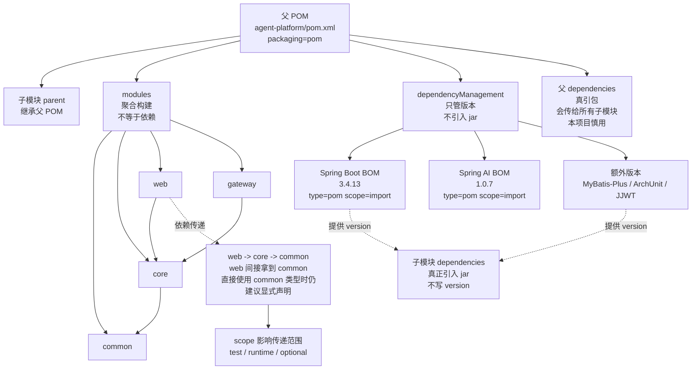

# Maven 依赖管理关系图

如果 `.drawio` 打不开，先看这个可读版。它和图表达的是同一件事。



## 记忆口诀

```text
parent：子模块继承父 POM。
modules：父工程聚合构建子模块，不代表模块互相依赖。
dependencyManagement：只管版本，不引入 jar。
父 dependencies：会真引包，并传给所有子模块，慎用。
子模块 dependencies：当前模块真正要用什么 jar，就在这里声明。
BOM：一张官方版本表，用 type=pom + scope=import 导入 dependencyManagement。
```
