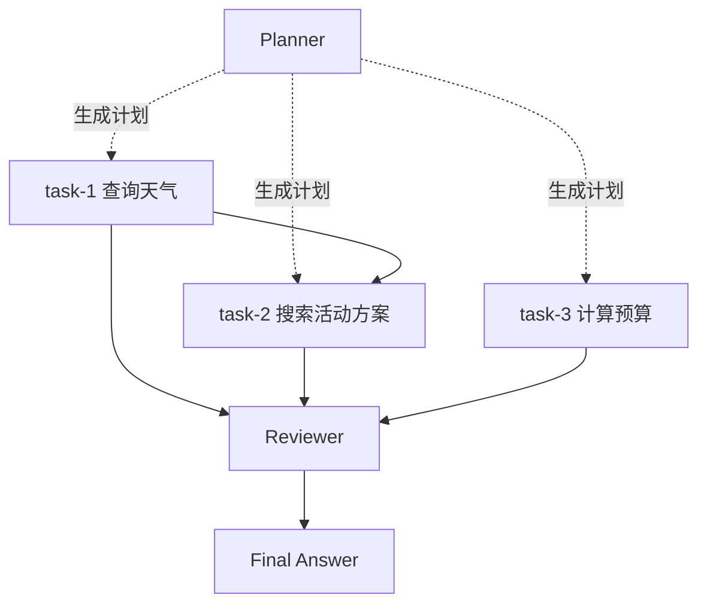

# 阶段 4 Agent Team 设计说明

## 1. 阶段目标

阶段 4 的目标是补齐 Agent Team 高分项，让平台在基础 Agent 之外，能稳定演示一次 Planner -> Executor -> Reviewer 的多 Agent 协作。

本阶段只围绕一个稳定 Demo 场景实现：

```text
活动策划 Team Demo
```

示例输入：

```text
帮我策划一个本周六下午在重庆适合 20 人的团建活动，预算 3000 元以内，最好不要太累。
```

完成标准：

- Planner 能输出结构化 TaskPlan。
- TaskPlan 经过后端校验。
- Executor 按依赖顺序执行任务，并调用授权 Skill / MCP Tool。
- Reviewer 审查执行结果。
- Reviewer 不通过时最多重试一次指定任务。
- Orchestrator 汇总最终答案。
- SSE 能阶段性实时展示 plan / execute / review / final 事件，不能等 Team 全部执行结束后一次性刷出过程。
- Trace Detail 能看到 planner、executor、reviewer、tool call 等 span。
- 前端 Chat 右侧能展示 Team 运行过程和 Mermaid 协作图。

## 2. 参考项目吸收

阶段 4 会结合之前参考项目，但只吸收设计思想，不替换当前项目架构。

| 参考项目 | 吸收内容 | 不吸收内容 |
|---|---|---|
| AgentX | 按执行阶段拆 Trace、三层校验、事务边界、运行记录可追溯 | 余额计费、完整 Agent 市场、完整 RAG |
| Spring AI Alibaba | Sequential / Routing / Loop 编排思想、Hook / Interceptor 思路、工具调用限制 | Graph Core、WebFlux/Reactor、Spring AI 自动工具执行 |
| emo | Team 黑板状态机、Run/Step/Event 思路、Planner/Executor/Reviewer 流程 | 多模块架构、RabbitMQ、Redis Stack、完整 Team 表体系 |
| MVP Claude Code | ToolRegistry / ToolDispatcher、子 Agent 工具物理隔离、上下文压缩和高危工具确认思路 | LangChain4j、Picocli、本地 File/Bash 裸工具、文件型 Memory |
| JeecgBoot | 后台页面组织、角色权限、AI 应用配置的信息架构 | Shiro、低代码引擎、动态网关路由、完整菜单管理 |

阶段 4 的核心取舍：

```text
用当前 Web / Gateway / Core / PostgreSQL 架构实现 Team。
不引入外部工作流引擎。
不引入新的中间件。
不把 Team 做成大而全产品，只做可演示闭环。
```

## 3. 范围边界

本阶段做：

- `core.team` 逻辑包。
- Team Orchestrator。
- Planner / Executor / Reviewer 三个角色服务。
- TaskPlan / ExecutionResult / ReviewResult DTO 和校验。
- AgentTool 统一运行时工具视图，供 Team Executor 使用。
- 基于 `agent_profiles.execution_mode = TEAM` 选择 Team Runtime。
- Chat SSE 增加 Team 事件。
- Trace Span 增加 Team 角色和任务维度。
- 前端 Chat 页面展示 Team 过程。

本阶段暂不做：

- 多个 Team 模板。
- 并发执行多个任务。
- 复杂工作流设计器。
- 独立 Team 数据表。
- 人工确认 UI。
- 高危工具执行。
- 完整 Pipeline 重构。
- token 级真实流式输出。

## 4. 运行模型

阶段 4 引入 Team Runtime，但不替换基础 Agent Runtime。

```text
AgentRuntimeService
  -> executionMode=BASIC 走现有 DefaultAgentRuntimeService
  -> executionMode=TEAM  走 TeamOrchestratorService
```

如果为了控制改动风险，也可以先在 `DefaultAgentRuntimeService` 内部读取 Profile executionMode 后委托给 `TeamRuntimeService`。最终外部入口仍保持：

```java
AgentRuntimeService.run(AgentRunCommand command)
```

Web / Gateway 不关心 Team 内部细节，仍然只发起 Chat SSE。

## 5. Team 角色职责

Team 的主数据流固定为：

```text
用户请求
 -> Planner 生成 TaskPlan
 -> TaskPlanValidator 校验
 -> Executor 执行 TOOL_TASK / MODEL_TASK
 -> Orchestrator 基于 ExecutionResult 生成 answerDraft
 -> Reviewer 审查 TaskPlan + ExecutionResult + answerDraft
 -> 必要时 Orchestrator 触发一次 retry
 -> Orchestrator 输出 finalAnswer
```

Reviewer 不直接生成最终答案，它只审查 `answerDraft` 是否满足用户目标。最终回答由 Orchestrator 根据执行结果和审查意见生成。

### 5.1 Planner

Planner 负责把用户目标拆成任务计划。

输入：

- 用户请求。
- Profile 补充 Prompt。
- 当前可用 AgentTool 描述。
- 会话上下文摘要。
- TaskPlan JSON Schema。

输出：

```json
{
  "goal": "string",
  "tasks": [
    {
      "id": "task-1",
      "name": "查询天气",
      "description": "查询重庆本周六下午天气",
      "taskType": "TOOL_TASK",
      "suggestedTool": "weather",
      "arguments": {
        "city": "重庆",
        "date": "本周六下午"
      },
      "dependsOn": []
    }
  ]
}
```

约束：

- 不调用工具。
- 不生成最终答案。
- 只能输出 JSON。
- 第一次输出非法时允许修正一次。
- 第二次仍失败时降级为通用单任务 fallback plan。

fallback plan 不绑定具体 Demo 或工具组合，格式固定为：

```json
{
  "goal": "用户原始请求",
  "tasks": [
    {
      "id": "task-1",
      "name": "直接处理用户请求",
      "description": "在不依赖工具计划的情况下，基于上下文直接回答用户问题。",
      "taskType": "MODEL_TASK",
      "suggestedTool": null,
      "arguments": {},
      "dependsOn": []
    }
  ]
}
```

活动策划的 weather / search / calculator 三任务计划只能作为 Demo seed 或测试数据，不作为通用 fallback 逻辑写死到 Planner 中。

### 5.2 Executor

Executor 负责按 TaskPlan 执行任务。

输入：

- 已校验 TaskPlan。
- 授权后的 AgentTool 列表。
- 已完成任务结果。

输出：

```json
{
  "taskId": "task-1",
  "taskType": "TOOL_TASK",
  "status": "success",
  "result": "重庆本周六下午可能小雨，建议优先室内活动。",
  "usedTools": ["weather"],
  "errorMessage": null
}
```

约束：

- 只能执行 Planner 分配的任务。
- 不能修改任务计划。
- 只能调用授权 AgentTool。
- 依赖任务失败时，当前任务可标记 `skipped`。
- 工具执行失败时返回 failed ExecutionResult，不直接中断整次 Team。

任务类型第一版只做两种：

| 类型 | 执行方式 |
|---|---|
| `TOOL_TASK` | 必须有 `suggestedTool`，由 AgentToolDispatcher 调用 Skill/MCP。 |
| `MODEL_TASK` | 不调用业务工具，由模型根据用户目标、Profile Prompt、TaskPlan 和已完成 ExecutionResult 生成任务结果。 |

`MODEL_TASK` 的模型输入必须包含：

```text
1. 用户原始请求
2. 当前任务描述
3. 已完成任务的 ExecutionResult 摘要
4. Profile 补充 Prompt
5. 输出要求：只输出当前任务结果，不重新规划任务
```

Executor 不负责最终汇总。最终汇总由 Orchestrator 在所有可执行任务结束后完成。

### 5.3 Reviewer

Reviewer 负责审查执行结果是否满足用户目标。

输入：

- 用户原始请求。
- TaskPlan。
- ExecutionResult 列表。
- Orchestrator 生成的 answerDraft。

输出：

```json
{
  "passed": true,
  "issues": [],
  "retryTasks": [],
  "summary": "方案已覆盖天气、预算和活动强度。"
}
```

约束：

- 不调用业务工具。
- 不重新规划任务。
- 只能建议重试已有任务。
- 重试最多一次。

## 6. AgentTool 统一工具视图

阶段 4 前先做一个轻量 AgentTool，不改 Skill/MCP 的底层表和执行接口。

```java
AgentTool {
  String name;
  String displayName;
  String description;
  String sourceType; // SKILL | MCP
  JsonNode parameterSchema;
  String riskLevel;  // LOW | MEDIUM | HIGH
}
```

Team Executor 只拿到授权后的 AgentTool 列表。

来源：

```text
Profile 绑定 Skill
+ Profile 绑定 MCP Tool
∩ 用户本次勾选
∩ 应用/用户权限
∩ 安全策略
```

这样 Planner 看到的是工具描述，Executor 拿到的是可调用权限，Reviewer 默认拿不到业务工具。

## 7. Trace 设计

阶段 4 不新增 Team 表，Team 运行数据先进入 Trace Span attributes。

推荐 span：

```text
team.run
team.plan
team.plan.validate
team.execute
team.task.execute
team.tool.call
team.review
team.retry
team.finalize
```

关键 attributes：

```json
{
  "teamRunId": "tr_xxx",
  "role": "PLANNER",
  "taskId": "task-1",
  "toolName": "weather",
  "retryIndex": 0,
  "taskStatus": "success"
}
```

注意：

- 不保存用户敏感原文。
- 工具参数和结果要脱敏并截断。
- TaskPlan / ReviewResult 可保存摘要，不保存过长全文。

## 8. SSE 事件设计

保持现有 SSE 基础事件，同时增加 Team 类型事件。

阶段 4 必须做阶段性实时推送：

```text
Planner 完成后立即推 team_plan。
每个任务开始时推 team_task_start。
每次工具调用前推 team_tool_call。
每次工具调用或模型任务完成后推 team_tool_result 或 team_task_result。
Reviewer 完成后立即推 team_review。
需要重试时立即推 team_retry。
最终答案生成后推 team_final / message / done。
```

不接受“Team 全部执行完后一次性吐出所有 team_* 事件”的方案。阶段 4 不要求 token 级流式输出，但 Team 阶段事件必须实时。

推荐事件：

```text
team_plan
team_task_start
team_tool_call
team_tool_result
team_task_result
team_review
team_retry
team_final
message
done
error
```

示例：

```json
{
  "type": "team_task_start",
  "traceId": "tr_xxx",
  "step": 3,
  "role": "EXECUTOR",
  "taskId": "task-1",
  "content": "开始查询天气"
}
```

前端收到后：

- 对话区展示简洁过程。
- 右侧 Team 面板展示完整任务列表和状态。
- Trace ID 可点击进入 Trace Detail。

## 9. Mermaid 展示

阶段 4 前端不做复杂流程编辑器，只根据 TaskPlan 和执行状态生成 Mermaid。

示例：



生成规则：

- Planner 到任务使用虚线，表示“生成计划”，不是执行流。
- dependsOn 生成任务之间的实线边，表示执行依赖。
- 没有被其他任务依赖的任务指向 Reviewer。
- Reviewer 指向 Final Answer。

## 10. 错误与降级

Planner JSON 非法：

```text
第 1 次：要求模型修正。
第 2 次：使用通用单任务 fallback plan，不写死活动策划工具组合。
```

工具不可用：

```text
任务标记 failed。
Reviewer 判断是否可接受。
最终答案说明缺失项。
```

Reviewer 不通过：

```text
按 retryTasks 最多重试一次。
仍不通过时返回当前最优结果和风险说明。
```

模型调用失败：

```text
当前角色 span 标记 FAILED。
SSE 返回 error。
Gateway 仍按阶段 2 规则记录 trace/token/alert。
```

## 11. Team 上限

Team 模式必须有整体上限，避免 Planner、Executor、Reviewer 或工具调用卡死。

第一版默认值：

| 限制项 | 默认值 | 说明 |
|---|---:|---|
| `maxTasks` | 8 | Planner 输出任务数量上限。 |
| `maxRetries` | 1 | Reviewer 不通过后最多重试一次。 |
| `maxToolCalls` | 8 | 单次 Team Run 工具调用总次数。 |
| `maxModelCalls` | 6 | Planner、MODEL_TASK、Reviewer、Final 汇总的模型调用总次数。 |
| `timeoutMs` | 120000 | 单次 Team Run 总超时，第一版可写成配置常量。 |

`Profile.maxSteps` 在 Team 模式下不再直接等于 ReAct loop 次数，而是可映射为 Team 复杂度：

```text
maxTasks = min(maxSteps + 3, 8)
maxModelCalls = min(maxSteps + 2, 6)
```

如果暂时不做动态映射，也必须在 `core.team` 中有固定常量，并在测试中覆盖超限场景。

## 12. 数据库取舍

阶段 4 不新增 `team_runs`、`team_tasks`、`team_messages`、`team_reviews` 表。

理由：

- 数据库模型文档已明确 Team 运行数据 MVP 可先存入 `trace_spans.attributes`。
- 当前阶段重点是稳定 Demo，不是做 Team 历史管理后台。
- 新表会带来 Entity、Mapper、查询、权限、前端列表等额外范围。

如果阶段 4 完成后还要增强，再新增：

```text
team_runs
team_tasks
team_messages
team_reviews
```

## 13. 前端范围

阶段 4 前端只增强 Chat 和 Trace：

- Profile 表单支持选择 `executionMode: BASIC | TEAM`。
- Chat 页面右侧增加 Team Run 面板。
- Chat 事件流展示 Team 步骤。
- Trace Detail 支持 Team span 的中文说明和展开详情。
- 生成 Mermaid 协作图。

不做：

- Team Designer。
- 拖拽流程编排。
- 多 Team 模板管理。

## 14. 验收 Demo

Demo 输入：

```text
帮我策划一个本周六下午在重庆适合 20 人的团建活动，预算 3000 元以内，最好不要太累。
```

期望过程：

```text
Planner 生成 3 个任务：
1. 查询天气：weather
2. 搜索活动方案：search
3. 计算人均预算：calculator

Executor 执行 3 个任务。
Reviewer 审查通过。
最终答案给出活动建议、预算、人均费用、天气风险和备选方案。
```

验收标准：

- 前端能看到 Team 过程。
- Trace 能看到 Planner / Executor / Reviewer span。
- 至少调用 calculator，weather/search 可用 mock 结果。
- 出错时返回可理解的失败原因，页面不崩溃。
