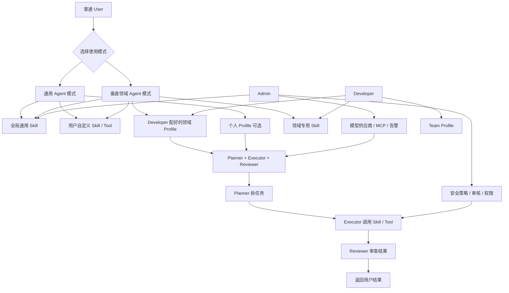

# Skill 与 Profile 使用方案

> ⚠ 角色体系已简化为 User/Admin 两角色（详见 CLAUDE.md 角色体系）。本文中的 Developer 视为 User。

## 1. 设计结论

本平台不是单个通用智能体，而是一个支持“通用 Agent + 垂直领域 Agent + 用户自定义能力”的 AI Agent 平台。

核心设计结论：

- Profile 负责配置智能体行为。
- Skill / Tool 负责扩展智能体能力。
- Agent Runtime 负责统一执行。
- AI Infra 层负责 Trace、Token、脱敏、告警和权限治理。

最终目标是让不同类型的智能体复用同一套底层能力，同时允许不同场景拥有自己的领域能力。

```text
智能体 = Agent Runtime + Profile + Skill / Tool + 记忆策略 + 安全策略
```

## 2. 两种使用模式

### 2.1 通用 Agent 模式

通用 Agent 模式面向临时任务、探索任务和高级用户自定义。

用户可以直接提出请求，也可以按需选择：

- 模型
- 全局通用 Skill
- 用户自定义 Skill / Tool
- 个人补充 Prompt
- 记忆策略
- 输出风格

通用模式下，用户不需要给 Planner、Executor、Reviewer 分别写提示词。系统内置一套通用的多 Agent System Prompt，用户直接输入任务即可。

### 2.2 垂直领域 Agent 模式

垂直领域 Agent 模式面向高频、稳定、需要业务封装的场景。

例如：

- 活动策划助手
- 客服助手
- 代码审查助手
- 飞书效率助手
- 企业知识库助手

这类智能体由 Developer 提前配置好领域 Profile、领域 Skill 和默认策略，普通用户打开后即可使用。

垂直模式的价值：

- 降低普通用户使用成本。
- 固化领域经验和业务规则。
- 控制 Skill / Tool 权限边界。
- 提高输出稳定性。

## 3. 三类 Skill / Tool

平台中的 Skill / Tool 分为三层。

### 3.1 全局通用 Skill

全局通用 Skill 由平台维护或 Admin 上架，适合低风险、高频、跨场景复用的能力。

示例：

- weather：天气查询
- calculator：计算器
- calendar：日历
- translate：翻译
- search：搜索
- map：地图
- file-summary：文件总结

特点：

- 全平台可见。
- 通用模式和垂直模式都可复用。
- 由 Admin 管理、审核、启用或禁用。

### 3.2 垂直领域 Skill

垂直领域 Skill 绑定到某个垂直智能体或应用中，用于体现业务专业性。

示例：

客服助手：

- order-query：订单查询
- logistics-query：物流查询
- ticket-create：工单创建
- refund-policy：售后规则查询

代码审查助手：

- git-diff：查看代码差异
- git-log：查看提交日志
- ci-status：查询 CI 状态
- code-review：代码审查

飞书助手：

- feishu-schedule：飞书日程
- feishu-group：一键拉群
- feishu-approval：审批提醒
- feishu-broadcast：消息广播

特点：

- 由 Developer 配置或上传。
- 通常只在对应领域 Agent 中可见。
- 普通用户使用该领域 Agent 时自动获得默认能力。

### 3.3 用户自定义 Skill / Tool

用户自定义 Skill / Tool 是普通用户上传的个人扩展能力。

示例：

- my-note-search：个人笔记搜索
- my-excel-analysis：个人表格分析
- my-company-room-query：个人会议室查询
- personal-budget-tool：个人预算工具

特点：

- 默认只对上传者本人可见。
- 不影响其他用户。
- 不修改领域 Agent 的公共配置。
- 必须经过安全检查、权限校验和热加载隔离。

## 4. Skill 合成规则

一次请求中，Agent 的可用 Skill 由当前模式决定。

通用模式：

```text
可用 Skill =
全局通用 Skill
+ 用户自定义 Skill / Tool
```

垂直领域模式：

```text
可用 Skill =
全局通用 Skill
+ 当前领域专用 Skill
+ 用户自定义 Skill / Tool
```

最终真正可调用的 Skill 还需要经过权限和安全策略过滤：

```text
最终可调用 Skill =
候选 Skill
∩ 用户权限
∩ 应用权限
∩ 安全策略
∩ 用户本次选择
```

如果某些 Skill 是领域 Agent 的必选能力，则由系统自动启用；如果是可选能力，则允许用户在本次对话中勾选。

## 5. Profile 的作用

Profile 是智能体配置，不是业务代码。

一个 Agent Profile 可以包含：

- 智能体名称
- 模型配置
- 补充 Prompt
- 默认 Skill
- 可选 Skill
- MCP Tool
- 记忆策略
- 安全策略
- Token 限额
- 输出风格
- 执行模式（MVP 固定为基础 Agent，后续可启用 Team 模式）

Profile 解决的是“如何配置一个智能体”，而不是“所有业务能力都靠配置实现”。

对于深度垂直领域，业务能力应该通过 Skill / MCP / 外部业务系统 API 扩展。

```text
垂直智能体 =
Profile
+ 领域 Skill
+ MCP Tool
+ 外部业务系统 API
+ 领域提示词
+ 权限和安全策略
```

## 6. Prompt 分层

系统提示词不建议让普通用户完全覆盖。

Prompt 分为三层：

```text
最终 Prompt =
平台内置核心 System Prompt
+ Profile 补充 Prompt
+ 用户本次请求
```

### 6.1 核心 System Prompt

由平台内置，用于固定角色职责和协作协议。

例如：

- Planner 只能拆解任务，不能调用工具。
- Executor 只能执行任务并调用授权 Skill / Tool。
- Reviewer 只能审查执行结果，不能直接执行业务操作。

核心 System Prompt 可由 Admin 维护，不建议开放给普通用户修改。

### 6.2 Profile 补充 Prompt

由 Developer 或高级用户配置，用于表达业务偏好、领域要求和输出风格。

例如：

```text
处理活动策划任务时，优先考虑天气、预算、交通便利性。
```

### 6.3 用户本次请求

普通用户输入的具体任务。

例如：

```text
帮我策划本周六下午在重庆适合 20 人的团建活动，预算 3000 元以内。
```

## 7. 多 Agent Team 设计

平台内置 Planner、Executor、Reviewer 的协作逻辑。

用户不需要分别给三个 Agent 配 Skill，也不需要理解每个角色内部细节。

推荐职责划分：

```text
Planner：拆解任务，不调用 Skill。
Executor：执行任务，调用 Skill / Tool。
Reviewer：审查结果，不直接执行业务操作。
```

Skill 统一绑定到当前任务、当前领域和当前用户，真正调用 Skill 的主要是 Executor。

这样可以降低配置复杂度：

- 用户只需要选择本次启用哪些 Skill。
- Developer 只需要配置领域默认 Skill 和可选 Skill。
- 平台负责把 Skill 权限传递给 Executor。

## 8. 角色职责

### 8.1 Admin

Admin 是平台管理员，负责全局能力和安全治理。

职责包括：

- 配置模型供应商。
- 管理全局 Skill 市场。
- 审核 / 上架 / 下架 Skill。
- 管理 MCP Server。
- 配置全局安全策略。
- 配置 Token 配额策略。
- 配置飞书告警。
- 管理用户、应用和权限。

### 8.2 Developer

Developer 是领域智能体或应用的配置者。

职责包括：

- 创建垂直领域 Agent Profile。
- 配置领域 Prompt。
- 配置默认 Skill / Tool。
- 上传领域专用 Skill。
- 设置哪些 Skill 允许普通用户选择。
- 后续增强：配置 Team Profile。
- 查看自己负责应用的 Trace 和 Token 用量。

Developer 的价值是把复杂配置封装成领域智能体，降低普通用户使用成本。

### 8.3 User

User 是普通使用者。

User 可以：

- 选择通用 Agent 或垂直领域 Agent。
- 输入请求。
- 选择本次启用哪些允许范围内的 Skill。
- 上传个人私有 Skill / Tool。
- 保存个人偏好。
- 查看自己的 Trace 和 Token 消耗。

User 不能：

- 修改领域 Agent 的公共 Profile。
- 修改核心 System Prompt。
- 影响其他用户。
- 启用未授权高危 Skill。
- 绕过安全检查。

## 9. Skill 热加载

热加载是指系统运行过程中，不重启后端服务，就能上传、校验、加载、注册和启用新的 Skill / Tool。

基本流程：

```text
上传 Skill Jar / 配置文件
 -> 保存文件
 -> 解析 Skill 元数据
 -> 校验参数 schema、版本、依赖、权限
 -> 安全检查
 -> 创建独立 ClassLoader 加载
 -> 注册到 Skill Registry
 -> 根据作用域启用
 -> Agent 可调用
```

推荐 Skill 状态：

```text
UPLOADED      已上传
VALIDATING    校验中
INSTALLED     已安装
ENABLED       已启用
LOADED        已加载到运行时
DISABLED      已禁用
FAILED        加载失败
UNINSTALLED   已卸载
```

垂直领域 Skill 不需要用户下载到本地，应由服务端统一管理。用户选择某个垂直 Agent 时，平台根据配置按需启用和加载对应 Skill。

## 10. 整体流程图



## 11. 最终总结

本方案采用三层 Skill 能力模型和两种使用模式。

三层 Skill：

```text
全局通用 Skill
+ 垂直领域 Skill
+ 用户自定义 Skill
```

两种使用模式：

```text
通用 Agent 模式：灵活、开放、适合临时任务。
垂直领域 Agent 模式：专业、稳定、适合高频业务。
```

整体原则：

```text
Admin 管全局平台能力。
Developer 封装垂直领域智能体。
User 使用智能体并进行个人增强。
平台统一负责运行、权限、安全、Trace、Token、告警和热加载。
```
