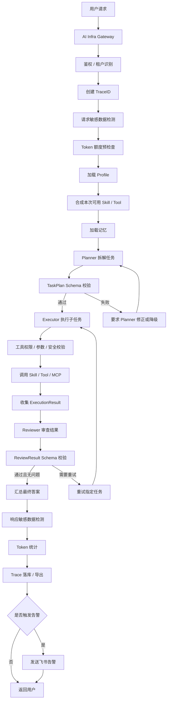

# 多 Agent 协作实现与约束方案

> ⚠ 角色体系已简化为 User/Admin 两角色（详见 CLAUDE.md 角色体系）。本文中的 Developer 视为 User。

## 1. 设计结论

Planner、Executor、Reviewer 是平台内置的多 Agent 协作框架，不要求用户自己编写三个 Agent 的代码。

用户或 Developer 配置的是：

- 模型
- Profile 补充 Prompt
- Skill / Tool 范围
- MCP Tool
- 记忆策略
- 安全策略
- Token 限额

平台内置并控制的是：

- 三个 Agent 的核心职责
- 多 Agent 协作流程
- 角色之间的消息传递协议
- 工具调用权限
- 输出 JSON Schema
- 异常处理和重试策略

核心原则：

```text
用户配置能力范围，平台控制协作边界。
```

## 2. 三个 Agent 的职责

### 2.1 Planner

Planner 负责理解用户目标，并拆解成结构化任务计划。

职责：

- 分析用户请求。
- 结合可用 Skill / Tool 描述拆解任务。
- 判断每个子任务建议使用哪个 Skill / Tool。
- 输出结构化任务计划。

约束：

- 不调用 Skill / Tool。
- 不直接执行任务。
- 不生成最终答案。
- 只能输出任务计划。

### 2.2 Executor

Executor 负责执行 Planner 分配的子任务。

职责：

- 读取 Planner 生成的任务计划。
- 按任务依赖顺序执行子任务。
- 调用本次授权的 Skill / Tool / MCP Tool。
- 收集每个子任务的执行结果。

约束：

- 不重新规划总任务。
- 不修改 Planner 的计划。
- 只能处理当前分配的子任务。
- 只能调用最终授权 Skill 集合中的工具。
- 输出必须符合执行结果结构。

### 2.3 Reviewer

Reviewer 负责审查 Executor 的执行结果。

职责：

- 检查执行结果是否完成用户目标。
- 判断是否有遗漏、冲突、工具失败或明显错误。
- 给出是否通过。
- 必要时指出需要重试的任务。

约束：

- 不重新规划任务。
- 不直接执行业务操作。
- 默认不调用业务 Skill / Tool。
- 只审查计划、执行结果和最终答案草稿。

## 3. Skill / Tool 绑定方式

不建议给 Planner、Executor、Reviewer 分别配置 Skill，否则配置复杂度会明显增加。

推荐方式：

```text
Skill / Tool 绑定到当前任务、当前领域和当前用户。
真正调用 Skill / Tool 的主要是 Executor。
```

也就是说：

- Planner 只能看到可用 Skill / Tool 的名称、描述和参数 Schema，用来规划任务。
- Executor 拿到实际调用权限，负责执行工具调用。
- Reviewer 默认不拿业务工具权限，只负责审查结果。

本次最终可用 Skill / Tool 由以下因素共同决定：

```text
最终可用 Skill / Tool =
全局通用 Skill
+ 当前领域专用 Skill
+ 用户自定义 Skill
∩ 用户权限
∩ 应用权限
∩ 安全策略
∩ 用户本次选择
```

## 4. Prompt 分层

三个 Agent 的 Prompt 不允许普通用户完全覆盖。

最终 Prompt 由三层组成：

```text
最终 Prompt =
平台内置核心 System Prompt
+ Profile 补充 Prompt
+ 当前任务上下文
```

### 4.1 核心 System Prompt

核心 System Prompt 由平台内置，用来固定角色职责、输出格式和权限边界。

例如 Planner：

```text
你是 Planner Agent。
你的职责是理解用户目标，并拆解成可执行子任务。
你不能调用工具。
你不能生成最终答案。
你必须输出符合 TaskPlan Schema 的 JSON。
```

例如 Executor：

```text
你是 Executor Agent。
你的职责是执行 Planner 分配的子任务。
你不能重新规划总任务。
你只能调用授权 Skill / Tool。
你必须输出符合 ExecutionResult Schema 的 JSON。
```

例如 Reviewer：

```text
你是 Reviewer Agent。
你的职责是审查 Executor 的执行结果。
你不能重新规划任务。
你不能直接执行业务操作。
你必须输出符合 ReviewResult Schema 的 JSON。
```

### 4.2 Profile 补充 Prompt

Profile 补充 Prompt 用来表达业务偏好、领域要求和输出风格。

例如活动策划领域：

```text
处理活动策划任务时，优先考虑天气、预算、交通便利性和活动强度。
```

补充 Prompt 不能覆盖核心角色职责。

### 4.3 当前任务上下文

运行时动态注入的信息包括：

- 用户原始请求
- 当前会话记忆
- 当前可用 Skill / Tool 列表
- Planner 任务计划
- Executor 执行结果
- TraceID
- Token 和安全策略上下文

## 5. Planner 拆任务机制

Planner 拆任务主要依赖 LLM，不通过大量 if-else 写死规则。

输入给 Planner 的内容：

- 用户原始请求
- 当前 Agent / Team Profile
- 当前可用 Skill / Tool 列表
- 每个 Skill / Tool 的名称、描述、参数 Schema
- 会话记忆和用户偏好
- Planner 核心 System Prompt
- 任务计划输出 Schema

Planner 输出结构化任务计划。

示例：

```json
{
  "goal": "为 20 人策划重庆本周六下午团建活动，预算 3000 元以内",
  "tasks": [
    {
      "id": "task-1",
      "name": "查询天气",
      "description": "查询重庆本周六下午天气，判断是否适合户外活动",
      "suggestedSkill": "weather",
      "arguments": {
        "city": "重庆",
        "date": "本周六下午"
      },
      "dependsOn": []
    },
    {
      "id": "task-2",
      "name": "搜索活动方案",
      "description": "搜索重庆适合 20 人、预算 3000 元以内、强度较低的团建活动",
      "suggestedSkill": "search",
      "arguments": {
        "query": "重庆 20人 团建 室内 预算3000 轻松"
      },
      "dependsOn": ["task-1"]
    },
    {
      "id": "task-3",
      "name": "计算人均预算",
      "description": "计算 3000 元预算下 20 人的人均费用",
      "suggestedSkill": "calculator",
      "arguments": {
        "expression": "3000 / 20"
      },
      "dependsOn": []
    }
  ]
}
```

## 6. 后端校验规则

不能只依赖 Prompt 约束，需要通过代码限制每个 Agent 的行为。

### 6.1 Planner 输出校验

Planner 输出后，后端需要校验：

- JSON 是否合法。
- 是否符合 TaskPlan Schema。
- taskId 是否唯一。
- suggestedSkill 是否在当前可用 Skill 列表中。
- dependsOn 是否引用存在任务。
- 是否存在循环依赖。
- 任务数量是否超过限制。

如果校验失败：

```text
第一次：要求 Planner 修正 JSON。
第二次：降级为单任务执行或返回规划失败。
```

### 6.2 Executor 调用校验

Executor 调用 Skill / Tool 前，后端需要校验：

- 当前任务是否允许执行。
- 依赖任务是否已完成。
- Skill / Tool 是否在最终授权集合中。
- 参数是否符合 Skill Schema。
- 是否触发敏感数据策略。
- 是否需要二次确认。
- 是否超过调用次数或 Token 限额。

### 6.3 Reviewer 输出校验

Reviewer 输出后，后端需要校验：

- 是否符合 ReviewResult Schema。
- 是否给出通过 / 不通过结论。
- retryTasks 是否引用真实存在的任务。
- 是否存在无法执行的重试建议。

## 7. 推荐 JSON Schema

### 7.1 TaskPlan

```json
{
  "goal": "string",
  "tasks": [
    {
      "id": "string",
      "name": "string",
      "description": "string",
      "suggestedSkill": "string|null",
      "arguments": {},
      "dependsOn": ["string"]
    }
  ]
}
```

### 7.2 ExecutionResult

```json
{
  "taskId": "string",
  "status": "success|failed|skipped",
  "result": "string",
  "usedTools": ["string"],
  "errorMessage": "string|null"
}
```

### 7.3 ReviewResult

```json
{
  "passed": true,
  "issues": [
    {
      "taskId": "string|null",
      "level": "info|warning|error",
      "message": "string"
    }
  ],
  "retryTasks": ["string"],
  "summary": "string"
}
```

## 8. 主执行流程

```text
用户请求
 -> 鉴权与租户识别
 -> 创建 TraceID
 -> 敏感数据检测
 -> Token 额度预检查
 -> 加载 Profile
 -> 合成本次可用 Skill / Tool
 -> 加载记忆
 -> Planner 拆解任务
 -> 校验 TaskPlan
 -> Executor 按依赖执行任务
 -> 调用授权 Skill / Tool
 -> 收集 ExecutionResult
 -> Reviewer 审查结果
 -> 校验 ReviewResult
 -> 必要时重试部分任务
 -> 汇总最终答案
 -> 响应脱敏
 -> Token 统计
 -> Trace 落库
 -> 异常触发飞书告警
 -> 返回用户
```

## 9. 流程图



## 10. 示例：活动策划任务

用户请求：

```text
帮我策划一个本周六下午在重庆适合 20 人的团建活动，预算 3000 元以内，最好不要太累。
```

Planner 输出：

```text
task-1：查询重庆本周六下午天气，建议使用 weather。
task-2：搜索适合 20 人的室内活动方案，建议使用 search。
task-3：计算人均预算，建议使用 calculator。
```

Executor 执行：

```text
调用 weather 查询天气。
调用 search 搜索活动方案。
调用 calculator 计算人均预算。
```

Reviewer 审查：

```text
天气是否考虑。
预算是否满足。
人数是否满足。
活动强度是否符合“不要太累”。
```

最终返回：

```text
推荐室内桌游馆或轰趴馆，预算控制在 3000 元以内，人均约 150 元。由于天气可能小雨，不建议长时间户外活动。
```

## 11. 最终总结

本方案将多 Agent 协作拆成三个稳定角色：

```text
Planner 负责规划。
Executor 负责执行。
Reviewer 负责审查。
```

平台通过以下机制防止流程失控：

- 核心 System Prompt 锁定角色职责。
- Profile 只提供补充 Prompt 和业务偏好。
- Skill / Tool 统一绑定到任务、领域和用户。
- 实际工具调用权限只交给 Executor。
- Planner、Executor、Reviewer 的输出都必须通过 JSON Schema 校验。
- 后端通过权限、参数、安全和依赖校验限制每一步行为。

最终实现效果：

```text
用户不用理解复杂的多 Agent 配置。
Developer 可以封装领域智能体。
平台可以稳定执行 Planner -> Executor -> Reviewer 协作流程。
```

