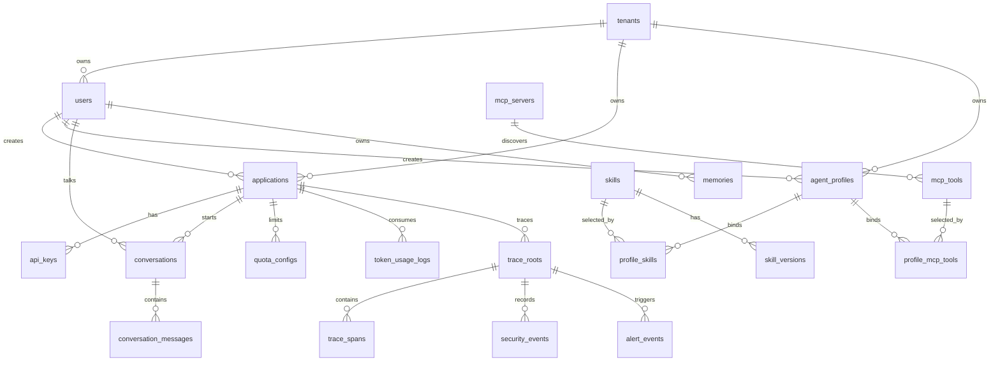

# 数据库模型设计

> 本文档用于确定数据库表、归属模块、核心字段和主要关系。它不是最终建表 SQL，后续可基于本文再生成 Flyway/Liquibase SQL。

---

## 1. 设计结论

### 1.1 总体原则

- 平台主库使用 PostgreSQL。
- `web` 和 `gateway` 不拥有业务表，只做入口、鉴权、协议转换和治理链。
- 平台核心业务表归 `core` 内部逻辑包管理。
- `feishu-bot` 是独立服务，使用独立配置库，不直接访问平台核心业务表。
- 每张表必须有明确归属包，禁止跨包直接查表。
- 所有对外列表查询都必须分页。
- API Key 只保存 hash，明文只在创建时展示一次。
- Token 配额相关记录必须可靠写入，不能只依赖异步任务。
- Trace Span 明细可以异步批量落库，但 TraceID 和 root span 创建必须同步。

### 1.2 命名约定

| 项目 | 约定 |
|------|------|
| 表名 | 小写下划线，复数或业务名词，如 `users`、`agent_profiles` |
| 主键 | `id BIGSERIAL` 或后续可替换为雪花 ID |
| 时间字段 | `created_at`、`updated_at` |
| 软删除 | 需要保留历史的表使用 `deleted_at` |
| 乐观锁 | 配置类表加 `version INT` |
| 状态字段 | 使用 `status VARCHAR(32)` |
| JSON 字段 | PostgreSQL 使用 `jsonb` |
| 多租户字段 | 核心业务表优先保留 `tenant_id` |
| 应用隔离字段 | 调用、Trace、Token、API Key 相关表保留 `application_id` |

---

## 2. 表归属总览

| 归属包 / 服务 | 表 | 说明 |
|------|------|------|
| `core.identity` | `tenants`、`users`、`roles`、`user_roles`、`applications`、`api_keys` | 租户、用户、角色、应用、API Key |
| `core.model` | `model_providers`、`model_configs` | 模型供应商与模型配置 |
| `core.profile` | `agent_profiles`、`profile_skills`、`profile_mcp_tools` | Agent Profile 与工具绑定 |
| `core.skill` | `skills`、`skill_versions`、`skill_artifacts` | Skill 元数据、版本、上传物 |
| `core.mcp` | `mcp_servers`、`mcp_tools` | MCP Server 与发现到的工具 |
| `core.agent` | `conversations`、`conversation_messages` | 会话和消息 |
| `core.experience` | `experience_skills` | 经验型 Skill 的上下文召回 |
| `core.memory` | `memories` | 长期记忆 |
| `core.quota` | `quota_configs`、`quota_reservations`、`token_usage_logs` | Token 配额、预扣、用量 |
| `core.trace` | `trace_roots`、`trace_spans` | Trace 主记录和 Span 明细 |
| `core.security` | `security_policies`、`security_events` | 安全策略与敏感事件 |
| `core.alert` | `alert_rules`、`alert_events` | 告警规则和告警事件 |
| `feishu-bot` | `feishu_configs`、`feishu_alert_logs`、`feishu_command_logs` | 飞书机器人独立配置和日志 |

---

## 3. 核心关系图



---

## 4. core.identity

### 4.1 `tenants`

平台保留租户模型，即使 MVP 只有默认租户，也不要删掉 `tenant_id`。

| 字段 | 类型 | 说明 |
|------|------|------|
| `id` | BIGSERIAL PK | 租户 ID |
| `name` | VARCHAR(128) | 租户名称 |
| `code` | VARCHAR(64) UNIQUE | 租户编码 |
| `status` | VARCHAR(32) | `ACTIVE` / `DISABLED` |
| `created_at` | TIMESTAMP | 创建时间 |
| `updated_at` | TIMESTAMP | 更新时间 |

### 4.2 `users`

| 字段 | 类型 | 说明 |
|------|------|------|
| `id` | BIGSERIAL PK | 用户 ID |
| `tenant_id` | BIGINT FK | 所属租户 |
| `username` | VARCHAR(64) | 登录名 |
| `password_hash` | VARCHAR(255) | 密码 hash |
| `display_name` | VARCHAR(128) | 展示名 |
| `email` | VARCHAR(128) NULL | 邮箱 |
| `status` | VARCHAR(32) | `ACTIVE` / `DISABLED` |
| `created_at` | TIMESTAMP | 创建时间 |
| `updated_at` | TIMESTAMP | 更新时间 |

约束：

- `(tenant_id, username)` 唯一。
- 不保存明文密码。

### 4.3 `roles` / `user_roles`

`roles` 保存角色定义，`user_roles` 保存用户角色关系。

MVP 角色：

- `ADMIN`
- `DEVELOPER`
- `USER`

`roles` 核心字段：

| 字段 | 类型 | 说明 |
|------|------|------|
| `id` | BIGSERIAL PK | 角色 ID |
| `code` | VARCHAR(64) UNIQUE | `ADMIN` / `DEVELOPER` / `USER` |
| `name` | VARCHAR(128) | 角色名称 |
| `description` | TEXT NULL | 说明 |
| `created_at` | TIMESTAMP | 创建时间 |

`user_roles` 核心字段：

| 字段 | 类型 | 说明 |
|------|------|------|
| `id` | BIGSERIAL PK | 关系 ID |
| `user_id` | BIGINT FK | 用户 |
| `role_id` | BIGINT FK | 角色 |
| `created_at` | TIMESTAMP | 创建时间 |

约束：

- `user_roles` 需要 `(user_id, role_id)` 唯一。

### 4.4 `applications`

Application 是 API Key、Token 配额、Trace 隔离的核心单位。

| 字段 | 类型 | 说明 |
|------|------|------|
| `id` | BIGSERIAL PK | 应用 ID |
| `tenant_id` | BIGINT FK | 租户 ID |
| `owner_user_id` | BIGINT FK | 创建者 |
| `name` | VARCHAR(128) | 应用名称 |
| `description` | TEXT NULL | 应用说明 |
| `status` | VARCHAR(32) | `ACTIVE` / `DISABLED` |
| `created_at` | TIMESTAMP | 创建时间 |
| `updated_at` | TIMESTAMP | 更新时间 |

约束：

- `(tenant_id, owner_user_id, name)` 唯一。

### 4.5 `api_keys`

| 字段 | 类型 | 说明 |
|------|------|------|
| `id` | BIGSERIAL PK | Key ID |
| `tenant_id` | BIGINT FK | 租户 ID |
| `application_id` | BIGINT FK | 所属应用 |
| `name` | VARCHAR(128) | Key 名称 |
| `key_prefix` | VARCHAR(32) | 明文前缀，如 `sk-abc...` 用于展示 |
| `key_hash` | VARCHAR(255) | bcrypt/argon2 hash |
| `status` | VARCHAR(32) | `ACTIVE` / `REVOKED` |
| `last_used_at` | TIMESTAMP NULL | 最近使用时间 |
| `expires_at` | TIMESTAMP NULL | 过期时间 |
| `created_at` | TIMESTAMP | 创建时间 |
| `revoked_at` | TIMESTAMP NULL | 吊销时间 |

约束：

- 只保存 hash，不保存完整明文。
- Key 绑定 Application，不直接绑定 User。
- `key_prefix` 建议唯一，认证时先按 prefix 定位候选记录，再校验 hash。

---

## 5. core.model

### 5.1 `model_providers`

| 字段 | 类型 | 说明 |
|------|------|------|
| `id` | BIGSERIAL PK | 供应商 ID |
| `name` | VARCHAR(128) | OpenAI / 通义千问 / Local |
| `provider_type` | VARCHAR(32) | `OPENAI_COMPATIBLE` / `QWEN` / `LOCAL` |
| `base_url` | VARCHAR(512) | API 地址 |
| `api_key_encrypted` | TEXT NULL | 加密后的模型 Key |
| `status` | VARCHAR(32) | `ACTIVE` / `DISABLED` |
| `created_at` | TIMESTAMP | 创建时间 |
| `updated_at` | TIMESTAMP | 更新时间 |

### 5.2 `model_configs`

| 字段 | 类型 | 说明 |
|------|------|------|
| `id` | BIGSERIAL PK | 模型配置 ID |
| `provider_id` | BIGINT FK | 供应商 |
| `model_name` | VARCHAR(128) | 实际模型名 |
| `display_name` | VARCHAR(128) | 展示名称 |
| `capabilities` | jsonb | text / vision / embedding / audio |
| `default_temperature` | NUMERIC(4,2) | 默认温度 |
| `max_context_tokens` | INT | 上下文上限 |
| `status` | VARCHAR(32) | 状态 |
| `created_at` | TIMESTAMP | 创建时间 |
| `updated_at` | TIMESTAMP | 更新时间 |

---

## 6. core.profile

### 6.1 `agent_profiles`

Profile 是智能体配置，不是业务代码。

| 字段 | 类型 | 说明 |
|------|------|------|
| `id` | BIGSERIAL PK | Profile ID |
| `tenant_id` | BIGINT FK | 租户 ID |
| `owner_user_id` | BIGINT FK NULL | 创建者，系统内置可为空 |
| `application_id` | BIGINT FK NULL | 绑定应用，可为空表示公共可用 |
| `name` | VARCHAR(128) | 名称 |
| `profile_type` | VARCHAR(32) | `GENERAL` / `DOMAIN` |
| `description` | TEXT | 描述 |
| `model_config_id` | BIGINT FK | 默认模型 |
| `prompt_extra` | TEXT | Profile 补充 Prompt |
| `memory_strategy` | jsonb | 短期/长期记忆策略 |
| `max_steps` | INT | ReAct 最大步数，防止工具循环失控 |
| `security_policy_id` | BIGINT FK NULL | 安全策略 |
| `execution_mode` | VARCHAR(32) | MVP 固定 `BASIC`，阶段 4 可为 `TEAM` |
| `visibility` | VARCHAR(32) | `PRIVATE` / `TENANT` / `PUBLIC` |
| `status` | VARCHAR(32) | `DRAFT` / `PUBLISHED` / `DISABLED` |
| `version` | INT | 乐观锁 |
| `created_at` | TIMESTAMP | 创建时间 |
| `updated_at` | TIMESTAMP | 更新时间 |

阶段注意：

- 阶段 1 如果暂不实现 `security_policies`，`security_policy_id` 可先保留 nullable 字段但不加外键约束；阶段 2 建安全策略表后再补外键。

### 6.2 `profile_skills`

| 字段 | 类型 | 说明 |
|------|------|------|
| `id` | BIGSERIAL PK | 关系 ID |
| `profile_id` | BIGINT FK | Profile |
| `skill_id` | BIGINT FK | Skill |
| `enabled_by_default` | BOOLEAN | 是否默认启用 |
| `required` | BOOLEAN | 是否必选 |
| `config_override` | jsonb NULL | 参数覆盖 |
| `created_at` | TIMESTAMP | 创建时间 |

约束：

- `(profile_id, skill_id)` 唯一。

### 6.3 `profile_mcp_tools`

| 字段 | 类型 | 说明 |
|------|------|------|
| `id` | BIGSERIAL PK | 关系 ID |
| `profile_id` | BIGINT FK | Profile |
| `mcp_tool_id` | BIGINT FK | MCP Tool |
| `enabled_by_default` | BOOLEAN | 是否默认启用 |
| `config_override` | jsonb NULL | 参数覆盖 |
| `created_at` | TIMESTAMP | 创建时间 |

---

## 7. core.skill

### 7.1 `skills`

| 字段 | 类型 | 说明 |
|------|------|------|
| `id` | BIGSERIAL PK | Skill ID |
| `tenant_id` | BIGINT FK | 租户 ID |
| `owner_user_id` | BIGINT FK NULL | 所属用户，系统全局 Skill 可为空 |
| `name` | VARCHAR(128) | Skill 名称 |
| `code` | VARCHAR(128) | 唯一编码 |
| `description` | TEXT | 描述 |
| `skill_type` | VARCHAR(32) | `BUILTIN` / `HTTP_CONFIG` / `JAR` |
| `scope` | VARCHAR(32) | `GLOBAL` / `DOMAIN` / `PERSONAL` |
| `permission_declaration` | jsonb | 网络、文件、数据库、命令执行等权限声明 |
| `status` | VARCHAR(32) | `UPLOADED` / `VALIDATING` / `INSTALLED` / `ENABLED` / `DISABLED` / `FAILED` |
| `current_version_id` | BIGINT NULL | 当前版本 |
| `created_at` | TIMESTAMP | 创建时间 |
| `updated_at` | TIMESTAMP | 更新时间 |

### 7.2 `skill_versions`

| 字段 | 类型 | 说明 |
|------|------|------|
| `id` | BIGSERIAL PK | 版本 ID |
| `skill_id` | BIGINT FK | Skill |
| `version` | VARCHAR(64) | 版本号 |
| `parameter_schema` | jsonb | 参数 Schema |
| `return_schema` | jsonb | 返回 Schema |
| `runtime_config` | jsonb | HTTP URL、Method、Header 模板等 |
| `dependencies` | jsonb | 依赖声明 |
| `checksum` | VARCHAR(128) NULL | Jar 或配置摘要 |
| `validation_result` | jsonb NULL | 校验结果 |
| `status` | VARCHAR(32) | `VALIDATING` / `READY` / `FAILED` |
| `created_at` | TIMESTAMP | 创建时间 |

### 7.3 `skill_artifacts`

用于保存 Jar、配置文件或上传物的元数据。实际文件可以存在磁盘、对象存储或数据库外部路径。

| 字段 | 类型 | 说明 |
|------|------|------|
| `id` | BIGSERIAL PK | 文件 ID |
| `skill_version_id` | BIGINT FK | Skill 版本 |
| `artifact_type` | VARCHAR(32) | `JAR` / `CONFIG` |
| `storage_path` | VARCHAR(512) | 存储路径 |
| `file_name` | VARCHAR(255) | 原始文件名 |
| `size_bytes` | BIGINT | 文件大小 |
| `checksum` | VARCHAR(128) | 校验和 |
| `created_at` | TIMESTAMP | 创建时间 |

---

## 8. core.mcp

### 8.1 `mcp_servers`

| 字段 | 类型 | 说明 |
|------|------|------|
| `id` | BIGSERIAL PK | MCP Server ID |
| `tenant_id` | BIGINT FK | 租户 |
| `name` | VARCHAR(128) | 名称 |
| `server_type` | VARCHAR(32) | `STDIO` / `HTTP` |
| `connection_config` | jsonb | 命令、URL、Header 等 |
| `status` | VARCHAR(32) | `ACTIVE` / `DISABLED` / `UNAVAILABLE` |
| `last_discovered_at` | TIMESTAMP NULL | 最近发现时间 |
| `created_at` | TIMESTAMP | 创建时间 |
| `updated_at` | TIMESTAMP | 更新时间 |

### 8.2 `mcp_tools`

| 字段 | 类型 | 说明 |
|------|------|------|
| `id` | BIGSERIAL PK | MCP Tool ID |
| `mcp_server_id` | BIGINT FK | MCP Server |
| `name` | VARCHAR(128) | 工具名 |
| `description` | TEXT | 描述 |
| `parameter_schema` | jsonb | 参数 Schema |
| `permission_declaration` | jsonb | 权限声明 |
| `status` | VARCHAR(32) | `AVAILABLE` / `UNAVAILABLE` |
| `created_at` | TIMESTAMP | 创建时间 |
| `updated_at` | TIMESTAMP | 更新时间 |

---

## 9. core.agent 与 core.memory

### 9.1 `conversations`

| 字段 | 类型 | 说明 |
|------|------|------|
| `id` | BIGSERIAL PK | 会话 ID |
| `tenant_id` | BIGINT FK | 租户 |
| `application_id` | BIGINT FK | 应用 |
| `user_id` | BIGINT FK | 用户 |
| `profile_id` | BIGINT FK | 使用的 Profile |
| `title` | VARCHAR(255) | 会话标题 |
| `channel` | VARCHAR(32) | `WEB` / `API_KEY` |
| `status` | VARCHAR(32) | `ACTIVE` / `ARCHIVED` |
| `metadata` | jsonb | 会话级快照，如 model_name、skill_ids、memory_strategy，便于历史列表展示 |
| `created_at` | TIMESTAMP | 创建时间 |
| `updated_at` | TIMESTAMP | 更新时间 |

### 9.2 `conversation_messages`

| 字段 | 类型 | 说明 |
|------|------|------|
| `id` | BIGSERIAL PK | 消息 ID |
| `conversation_id` | BIGINT FK | 会话 |
| `trace_id` | VARCHAR(64) NULL | 所属 Trace |
| `role` | VARCHAR(32) | `system` / `user` / `assistant` / `tool` |
| `content` | TEXT | 脱敏后的消息内容 |
| `token_count` | INT NULL | 单条消息 token 数，用于滑动窗口截断 |
| `tool_call_id` | VARCHAR(128) NULL | 工具调用 ID |
| `metadata` | jsonb | 模型、工具、错误等附加信息 |
| `created_at` | TIMESTAMP | 创建时间 |

要求：

- 存储前经过敏感数据策略处理。
- 大内容后续可拆到对象存储，MVP 先用 TEXT。

### 9.3 `memories`

| 字段 | 类型 | 说明 |
|------|------|------|
| `id` | BIGSERIAL PK | 记忆 ID |
| `tenant_id` | BIGINT FK | 租户 |
| `user_id` | BIGINT FK | 用户 |
| `application_id` | BIGINT FK NULL | 应用 |
| `profile_id` | BIGINT FK NULL | Profile |
| `memory_type` | VARCHAR(32) | `SUMMARY` / `PREFERENCE` / `FACT` |
| `memory_category` | VARCHAR(32) | `summary` / `preference` / `fact` / `episodic` / `tool_failure` / `policy` / `general` |
| `content` | TEXT | 脱敏后的记忆内容 |
| `keywords` | TEXT[] NULL | MVP 关键词检索字段，不依赖向量库也能做简单召回 |
| `tags` | TEXT[] | 召回过滤标签，默认空数组 |
| `importance` | NUMERIC(4,3) | 重要性评分，0.0-1.0，默认 0.5 |
| `slot_hint` | VARCHAR(64) NULL | 建议注入的上下文槽位，如 `task_memory` / `recall` |
| `metadata` | jsonb | 扩展元数据，默认 `{}` |
| `embedding` | VECTOR NULL | 后续向量库扩展，MVP 可不建 |
| `source_conversation_id` | BIGINT FK NULL | 来源会话 |
| `status` | VARCHAR(32) | `ACTIVE` / `DISABLED` |
| `created_at` | TIMESTAMP | 创建时间 |
| `updated_at` | TIMESTAMP | 更新时间 |

MVP 如果不启用 pgvector，可以先不建 `embedding` 字段，或保留为 NULL 注释字段。当前 Memory v2 第一层先落地 `memory_category`、`tags`、`importance`、`slot_hint` 和 `metadata`，继续使用 PostgreSQL 关键词召回和过滤排序；语义召回后续通过 VectorStore/Qdrant 扩展。

### 9.4 `knowledge_documents`

RAG 知识文档元信息表，归 `core.rag` 管理。PostgreSQL 保存业务真相，Qdrant 只保存后续向量索引。

| 字段 | 类型 | 说明 |
|------|------|------|
| `id` | BIGSERIAL PK | 知识文档 ID |
| `tenant_id` | BIGINT FK | 租户 |
| `application_id` | BIGINT FK | 应用 |
| `profile_id` | BIGINT FK NULL | Profile 作用域，空表示应用内通用 |
| `owner_user_id` | BIGINT FK | 上传/拥有用户 |
| `title` | VARCHAR(255) | 文档标题 |
| `source_type` | VARCHAR(32) | `MANUAL` / `URL` / `FILE` 等来源类型 |
| `source_uri` | VARCHAR(512) NULL | 来源地址或内部存储路径 |
| `doc_hash` | VARCHAR(128) | 文档内容 hash，用于同 scope 去重替换 |
| `status` | VARCHAR(32) | `INDEXED` / `DELETED` / `FAILED` |
| `metadata` | jsonb | chunk 策略、embedding 模型版本等扩展元数据 |
| `created_at` | TIMESTAMP | 创建时间 |
| `updated_at` | TIMESTAMP | 更新时间 |

约束：

- `(tenant_id, application_id, owner_user_id, coalesce(profile_id, 0), doc_hash)` 在 `INDEXED` 状态下唯一。
- `knowledge_documents` 不保存用户长期偏好；用户长期状态仍归 `memories`。

### 9.5 `knowledge_chunks`

RAG 文档分块原文表，归 `core.rag` 管理。

| 字段 | 类型 | 说明 |
|------|------|------|
| `id` | BIGSERIAL PK | Chunk ID |
| `tenant_id` | BIGINT FK | 租户 |
| `application_id` | BIGINT FK | 应用 |
| `document_id` | BIGINT FK | 所属知识文档 |
| `chunk_index` | INT | 文档内顺序 |
| `content` | TEXT | chunk 原文 |
| `content_hash` | VARCHAR(128) | chunk 内容 hash |
| `token_count` | INT | 估算 token 数 |
| `vector_id` | VARCHAR(128) NULL | Qdrant point id，未接向量库时为空 |
| `status` | VARCHAR(32) | `ACTIVE` / `DELETED` |
| `metadata` | jsonb | headingPath、sourceUri、documentTitle 等元数据 |
| `created_at` | TIMESTAMP | 创建时间 |
| `updated_at` | TIMESTAMP | 更新时间 |

首版 RAG PG 骨架使用 PostgreSQL keyword fallback；后续 Qdrant 接入后，`vector_id` 关联向量索引，检索仍需按 tenant/application/profile payload 过滤并回表取 chunk 原文。

### 9.6 `experience_skills`

| 字段 | 类型 | 说明 |
|------|------|------|
| `id` | BIGSERIAL PK | 经验 Skill ID |
| `tenant_id` | BIGINT FK | 租户 |
| `application_id` | BIGINT FK NULL | 应用作用域，空表示租户内通用 |
| `user_id` | BIGINT FK NULL | 用户作用域，空表示非个人私有 |
| `profile_id` | BIGINT FK NULL | Profile 作用域，空表示不绑定特定 Profile |
| `code` | VARCHAR(128) | 租户内唯一编码 |
| `name` | VARCHAR(128) | 展示名称 |
| `domain` | VARCHAR(64) NULL | 领域或 Profile 类型匹配字段 |
| `trigger_keywords` | TEXT[] NULL | 触发关键词 |
| `content` | TEXT | 注入上下文的经验内容 |
| `status` | VARCHAR(32) | `ACTIVE` / `DISABLED` |
| `created_at` | TIMESTAMP | 创建时间 |
| `updated_at` | TIMESTAMP | 更新时间 |

经验型 Skill 只进入 Agent Context 的 `apiMessages`，不进入 tools，不经过 ToolDispatcher。

---

## 10. core.quota

### 10.1 `quota_configs`

| 字段 | 类型 | 说明 |
|------|------|------|
| `id` | BIGSERIAL PK | 配额配置 ID |
| `tenant_id` | BIGINT FK | 租户 |
| `subject_type` | VARCHAR(32) | `USER` / `APPLICATION` |
| `subject_id` | BIGINT | 用户 ID 或应用 ID |
| `daily_limit_tokens` | BIGINT | 日限额 |
| `monthly_limit_tokens` | BIGINT | 月限额 |
| `single_request_limit_tokens` | BIGINT | 单次请求限额 |
| `status` | VARCHAR(32) | `ACTIVE` / `DISABLED` |
| `version` | INT | 乐观锁版本，用于并发预扣 CAS |
| `created_at` | TIMESTAMP | 创建时间 |
| `updated_at` | TIMESTAMP | 更新时间 |

约束：

- `(tenant_id, subject_type, subject_id)` 唯一。
- 配额预扣必须采用 `version` CAS 更新，或在事务中对配额行使用 `SELECT ... FOR UPDATE` 行锁，不能用“先查余额再更新”的非原子写法。

### 10.2 `quota_reservations`

请求前预扣记录，用于失败释放和最终修正。

| 字段 | 类型 | 说明 |
|------|------|------|
| `id` | BIGSERIAL PK | 预扣 ID |
| `trace_id` | VARCHAR(64) | TraceID |
| `tenant_id` | BIGINT FK | 租户 |
| `application_id` | BIGINT FK | 应用 |
| `user_id` | BIGINT FK | 用户 |
| `estimated_tokens` | BIGINT | 预估 Token |
| `actual_tokens` | BIGINT NULL | 实际 Token |
| `status` | VARCHAR(32) | `RESERVED` / `COMMITTED` / `RELEASED` / `FAILED` |
| `version` | INT | 乐观锁版本，用于幂等释放和结算 |
| `created_at` | TIMESTAMP | 创建时间 |
| `updated_at` | TIMESTAMP | 更新时间 |

约束：

- `trace_id` 唯一，保证同一请求的预扣、释放和结算可以幂等重试。
- 状态只能按 `RESERVED -> COMMITTED`、`RESERVED -> RELEASED`、`RESERVED -> FAILED` 流转。
- 释放预扣和提交结算必须按 `trace_id + status + version` 做条件更新，避免重复释放或重复扣减。

### 10.3 `token_usage_logs`

| 字段 | 类型 | 说明 |
|------|------|------|
| `id` | BIGSERIAL PK | 用量记录 ID |
| `trace_id` | VARCHAR(64) | TraceID |
| `tenant_id` | BIGINT FK | 租户 |
| `application_id` | BIGINT FK | 应用 |
| `user_id` | BIGINT FK | 用户 |
| `model_config_id` | BIGINT FK NULL | 模型 |
| `provider_code` | VARCHAR(64) NULL | Provider 快照，如 `openai` / `qwen` / `mock` |
| `model_name` | VARCHAR(128) NULL | 模型名快照，避免模型配置改名后历史统计失真 |
| `channel` | VARCHAR(32) | `WEB` / `API_KEY` |
| `agent_mode` | VARCHAR(32) | `agent` / `none` |
| `prompt_tokens` | BIGINT | prompt token |
| `completion_tokens` | BIGINT | completion token |
| `total_tokens` | BIGINT | 总 token |
| `tokens_estimated` | BOOLEAN | Token 是否为估算值 |
| `stream` | BOOLEAN | 是否流式模型调用 |
| `created_at` | TIMESTAMP | 创建时间 |

索引：

- `(tenant_id, application_id, created_at)`
- `(tenant_id, user_id, created_at)`
- `(tenant_id, model_config_id, created_at)`
- `trace_id`

---

## 11. core.trace

### 11.1 `trace_roots`

| 字段 | 类型 | 说明 |
|------|------|------|
| `id` | BIGSERIAL PK | 内部 ID |
| `trace_id` | VARCHAR(64) UNIQUE | 对外 TraceID |
| `tenant_id` | BIGINT FK | 租户 |
| `application_id` | BIGINT FK | 应用 |
| `user_id` | BIGINT FK | 用户 |
| `channel` | VARCHAR(32) | `WEB` / `API_KEY` |
| `request_path` | VARCHAR(255) | 请求路径 |
| `agent_mode` | VARCHAR(32) | `agent` / `none` |
| `profile_id` | BIGINT FK NULL | Profile |
| `model_config_id` | BIGINT FK NULL | 模型 |
| `status` | VARCHAR(32) | `SUCCESS` / `FAILED` / `BLOCKED` |
| `error_code` | VARCHAR(64) NULL | 错误码 |
| `latency_ms` | BIGINT | 总耗时 |
| `ttft_ms` | BIGINT NULL | Time To First Token，发起模型请求到首 token 返回的耗时 |
| `tpot_ms` | BIGINT NULL | Time Per Output Token，首 token 之后平均每个输出 token 耗时 |
| `prompt_tokens` | BIGINT NULL | prompt token |
| `completion_tokens` | BIGINT NULL | completion token |
| `total_tokens` | BIGINT NULL | 总 token |
| `tokens_estimated` | BOOLEAN | Token 是否为估算值 |
| `stream` | BOOLEAN | 是否流式模型调用 |
| `started_at` | TIMESTAMP | 开始时间 |
| `finished_at` | TIMESTAMP NULL | 结束时间 |
| `profile_snapshot` | jsonb NULL | 当时关键 Profile 快照 |
| `skill_snapshot` | jsonb NULL | 当时工具快照 |

说明：

- `latency_ms` 是完整请求总耗时，不等于 TTFT。
- `ttft_ms` 只统计模型调用发出到第一个 token 返回的时间；非流式或 Mock 调用可为空。
- `tpot_ms` 统计首 token 之后的平均输出速度；没有流式 token 明细时可为空。
- Provider / Model 维度优先通过 `model_config_id` 关联；重要报表可在 `profile_snapshot` 或 `trace_spans.attributes` 中保存快照，避免历史配置变更影响追溯。

### 11.2 `trace_spans`

| 字段 | 类型 | 说明 |
|------|------|------|
| `id` | BIGSERIAL PK | Span ID |
| `trace_id` | VARCHAR(64) | TraceID |
| `span_id` | VARCHAR(64) | SpanID |
| `parent_span_id` | VARCHAR(64) NULL | 父 Span |
| `name` | VARCHAR(128) | `gateway.receive` / `model.call` / `skill.call` 等 |
| `span_type` | VARCHAR(32) | `GATEWAY` / `MODEL` / `SKILL` / `MCP` / `MEMORY` |
| `status` | VARCHAR(32) | `SUCCESS` / `FAILED` / `SKIPPED` |
| `start_time` | TIMESTAMP | 开始 |
| `end_time` | TIMESTAMP NULL | 结束 |
| `latency_ms` | BIGINT NULL | 耗时 |
| `attributes` | jsonb | 结构化属性，必须脱敏 |
| `error_message` | TEXT NULL | 错误信息，必须脱敏 |

`model.call` Span 的 `attributes` 建议包含脱敏后的 GenAI 指标：

```json
{
  "provider_code": "mock",
  "model_name": "mock-chat",
  "stream": true,
  "ttft_ms": 120,
  "tpot_ms": 35,
  "prompt_tokens": 100,
  "completion_tokens": 40,
  "total_tokens": 140
}
```

MVP 至少记录：

- `gateway.receive`
- `security.scan.request`
- `quota.check`
- `profile.load`
- `model.call`
- `skill.call` 或 `mcp.call`
- `security.scan.response`
- `token.record`
- `trace.finish`

---

## 12. core.security

### 12.1 `security_policies`

| 字段 | 类型 | 说明 |
|------|------|------|
| `id` | BIGSERIAL PK | 策略 ID |
| `tenant_id` | BIGINT FK | 租户 |
| `name` | VARCHAR(128) | 策略名 |
| `mode` | VARCHAR(32) | `MASK` / `BLOCK` |
| `rules` | jsonb | 手机号、身份证、邮箱、银行卡、IP、自定义关键词 |
| `skill_blacklist` | jsonb | 禁用 Skill |
| `skill_whitelist` | jsonb | 可用 Skill |
| `status` | VARCHAR(32) | `ACTIVE` / `DISABLED` |
| `created_at` | TIMESTAMP | 创建时间 |
| `updated_at` | TIMESTAMP | 更新时间 |

### 12.2 `security_events`

| 字段 | 类型 | 说明 |
|------|------|------|
| `id` | BIGSERIAL PK | 事件 ID |
| `trace_id` | VARCHAR(64) | TraceID |
| `tenant_id` | BIGINT FK | 租户 |
| `application_id` | BIGINT FK | 应用 |
| `user_id` | BIGINT FK | 用户 |
| `event_type` | VARCHAR(64) | `PHONE` / `ID_CARD` / `EMAIL` / `CUSTOM_KEYWORD` |
| `location` | VARCHAR(64) | `REQUEST` / `RESPONSE` / `TOOL_INPUT` / `TOOL_OUTPUT` / `MEMORY` / `TRACE_LOG` |
| `action` | VARCHAR(32) | `MASKED` / `BLOCKED` |
| `source_text_hash` | VARCHAR(128) NULL | 原始命中文本 hash，用于排查同类事件，不保存原文 |
| `masked_sample` | TEXT | 脱敏后的样例 |
| `created_at` | TIMESTAMP | 创建时间 |

要求：

- 不保存原始敏感值。
- 可通过 `trace_id` 回查整次调用。

---

## 13. core.alert

### 13.1 `alert_rules`

| 字段 | 类型 | 说明 |
|------|------|------|
| `id` | BIGSERIAL PK | 规则 ID |
| `tenant_id` | BIGINT FK | 租户 |
| `name` | VARCHAR(128) | 规则名称 |
| `alert_type` | VARCHAR(64) | `MODEL_ERROR` / `ERROR_RATE` / `TOKEN_EXCEEDED` / `SECURITY_BLOCKED` |
| `condition_config` | jsonb | 阈值、窗口、级别 |
| `silence_minutes` | INT | 静默期 |
| `status` | VARCHAR(32) | `ACTIVE` / `DISABLED` |
| `created_at` | TIMESTAMP | 创建时间 |
| `updated_at` | TIMESTAMP | 更新时间 |

### 13.2 `alert_events`

| 字段 | 类型 | 说明 |
|------|------|------|
| `id` | BIGSERIAL PK | 告警事件 ID |
| `trace_id` | VARCHAR(64) NULL | TraceID |
| `tenant_id` | BIGINT FK | 租户 |
| `application_id` | BIGINT FK NULL | 应用 |
| `alert_type` | VARCHAR(64) | 告警类型 |
| `level` | VARCHAR(32) | `INFO` / `WARN` / `ERROR` / `CRITICAL` |
| `title` | VARCHAR(255) | 标题 |
| `content` | TEXT | 脱敏后的内容 |
| `suggestion` | TEXT NULL | 建议动作 |
| `notify_status` | VARCHAR(32) | `PENDING` / `SENT` / `FAILED` / `SILENCED` |
| `retry_count` | INT | 重试次数 |
| `created_at` | TIMESTAMP | 创建时间 |
| `sent_at` | TIMESTAMP NULL | 发送时间 |

---

## 14. feishu-bot 独立库

### 14.1 `feishu_configs`

| 字段 | 类型 | 说明 |
|------|------|------|
| `id` | BIGSERIAL PK | 配置 ID |
| `app_id` | VARCHAR(128) | 飞书应用 ID |
| `app_secret_encrypted` | TEXT | 加密后的 secret |
| `verification_token` | VARCHAR(255) NULL | Webhook 校验 token |
| `encrypt_key` | VARCHAR(255) NULL | 事件加密 key |
| `default_alert_chat_id` | VARCHAR(128) NULL | 默认告警群 |
| `status` | VARCHAR(32) | `ACTIVE` / `DISABLED` |
| `created_at` | TIMESTAMP | 创建时间 |
| `updated_at` | TIMESTAMP | 更新时间 |

### 14.2 `feishu_alert_logs`

记录平台告警消息发送结果。

| 字段 | 类型 | 说明 |
|------|------|------|
| `id` | BIGSERIAL PK | 日志 ID |
| `trace_id` | VARCHAR(64) NULL | 平台 TraceID |
| `alert_event_id` | BIGINT NULL | 平台告警事件 ID，仅保存引用值 |
| `chat_id` | VARCHAR(128) | 飞书群 ID |
| `message_type` | VARCHAR(32) | `TEXT` / `CARD` |
| `payload` | jsonb | 发送内容，已脱敏 |
| `status` | VARCHAR(32) | `SENT` / `FAILED` |
| `error_message` | TEXT NULL | 错误信息 |
| `created_at` | TIMESTAMP | 创建时间 |

### 14.3 `feishu_command_logs`

| 字段 | 类型 | 说明 |
|------|------|------|
| `id` | BIGSERIAL PK | 日志 ID |
| `open_id` | VARCHAR(128) | 飞书用户 |
| `chat_id` | VARCHAR(128) | 群 ID |
| `command` | VARCHAR(64) | `/weather` / `/review` 等 |
| `arguments` | jsonb | 参数 |
| `status` | VARCHAR(32) | `SUCCESS` / `FAILED` |
| `result_summary` | TEXT NULL | 结果摘要 |
| `created_at` | TIMESTAMP | 创建时间 |

---

## 15. MVP 必建表与增强表

### 15.1 阶段 1 必建

- `tenants`
- `users`
- `roles`
- `user_roles`
- `applications`
- `api_keys`
- `model_providers`
- `model_configs`
- `agent_profiles`
- `skills`
- `skill_versions`
- `profile_skills`
- `mcp_servers`
- `mcp_tools`
- `profile_mcp_tools`
- `conversations`
- `conversation_messages`
- `memories`

### 15.2 阶段 2 必建

- `quota_configs`
- `quota_reservations`
- `token_usage_logs`
- `trace_roots`
- `trace_spans`
- `security_policies`
- `security_events`
- `alert_rules`
- `alert_events`
- `feishu_configs`
- `feishu_alert_logs`

### 15.3 阶段 4 增强

Team 相关运行数据 MVP 可先存入 `trace_spans.attributes`。如果需要更强展示，再新增：

- `team_runs`
- `team_tasks`
- `team_messages`
- `team_reviews`

### 15.4 暂缓增强

- 真实支付订单表
- 发票表
- 复杂成本账单表
- 向量知识库文档表
- Jar 沙箱执行审计表

---

## 16. 主链路校验

### 16.1 用户注册登录

```text
users
roles
user_roles
applications
api_keys
quota_configs
```

注册后创建用户；用户进入个人中心创建 Application；Application 生成 API Key；Admin 可配置用户级/应用级 Token 配额。

### 16.2 浏览器对话

```text
users -> applications -> agent_profiles
-> conversations -> conversation_messages
-> trace_roots / trace_spans
-> token_usage_logs
```

浏览器 AI 请求走 `Web -> Gateway -> Core`，但数据仍归 core 表。

### 16.3 API Key 调用

```text
api_keys -> applications -> quota_configs
-> trace_roots -> token_usage_logs
```

Gateway 通过 API Key hash 找到 Application，再进入统一治理链。

### 16.4 Skill / MCP 调用

```text
agent_profiles
-> profile_skills / profile_mcp_tools
-> skills / mcp_tools
-> trace_spans
```

Agent Runtime 不直接查 Skill 表，必须通过 `SkillRegistry` / `McpToolRegistry`。

### 16.5 脱敏与告警

```text
security_policies -> security_events
alert_rules -> alert_events
feishu_alert_logs
```

敏感数据事件归 core.security；告警事件归 core.alert；飞书发送结果归 feishu-bot 独立库。

---

## 17. 索引建议

| 表 | 索引 |
|------|------|
| `users` | `(tenant_id, username)` unique |
| `applications` | `(tenant_id, owner_user_id)` |
| `api_keys` | `(application_id, status)`、`key_prefix` |
| `agent_profiles` | `(tenant_id, profile_type, status)` |
| `skills` | `(tenant_id, scope, status)`、`(tenant_id, code)` unique |
| `conversations` | `(tenant_id, user_id, updated_at)` |
| `conversation_messages` | `(conversation_id, created_at)` |
| `token_usage_logs` | `(tenant_id, application_id, created_at)`、`(tenant_id, user_id, created_at)`、`(tenant_id, model_config_id, created_at)`、`trace_id` |
| `trace_roots` | `trace_id unique`、`(tenant_id, application_id, started_at)`、`(tenant_id, model_config_id, started_at)` |
| `trace_spans` | `(trace_id, start_time)` |
| `security_events` | `(tenant_id, application_id, created_at)`、`trace_id` |
| `alert_events` | `(tenant_id, notify_status, created_at)`、`trace_id` |

---

## 18. 需要避免的设计错误

- 不要让 `web` 或 `gateway` 拥有 `users`、`api_keys`、`quota`、`trace` 等表。
- 不要让 `agent` 包直接查 `skills` 表，应通过 `SkillRegistry`。
- 不要让 `quota` 包直接查 `users` 表，应通过 `IdentityService`。
- 不要把 `feishu-bot` 日志写入平台核心库。
- 不要保存原始敏感数据到 `trace_spans`、`security_events`、`conversation_messages`。
- 不要把 Team / Personal 做成独立 Profile 类型；Team 是执行模式，Personal 是用户偏好。
- 不要把真实支付表放进 MVP。

---

## 19. 下一步

数据库模型确定后，建议继续做：

1. 生成核心表 ER 图。
2. 生成 PostgreSQL 初始化 SQL。
3. 设计 core 内部包目录与 Entity / Mapper / Service 归属。
4. 设计主链路接口 DTO：注册登录、创建 Application、创建 Profile、Agent 对话、Trace 查询、Token 查询。
