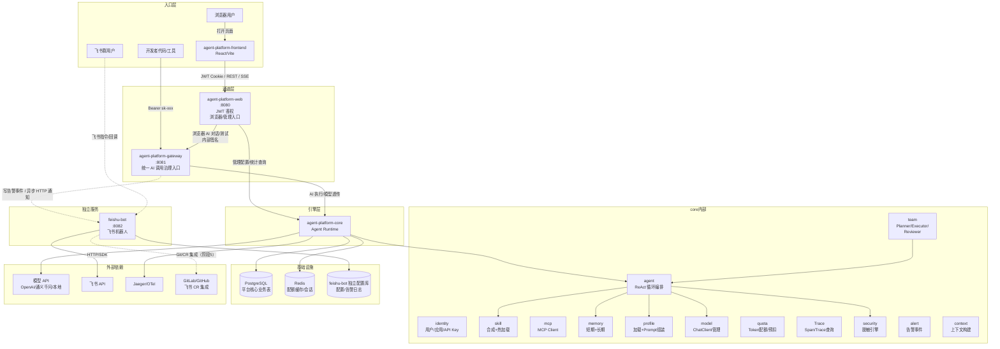
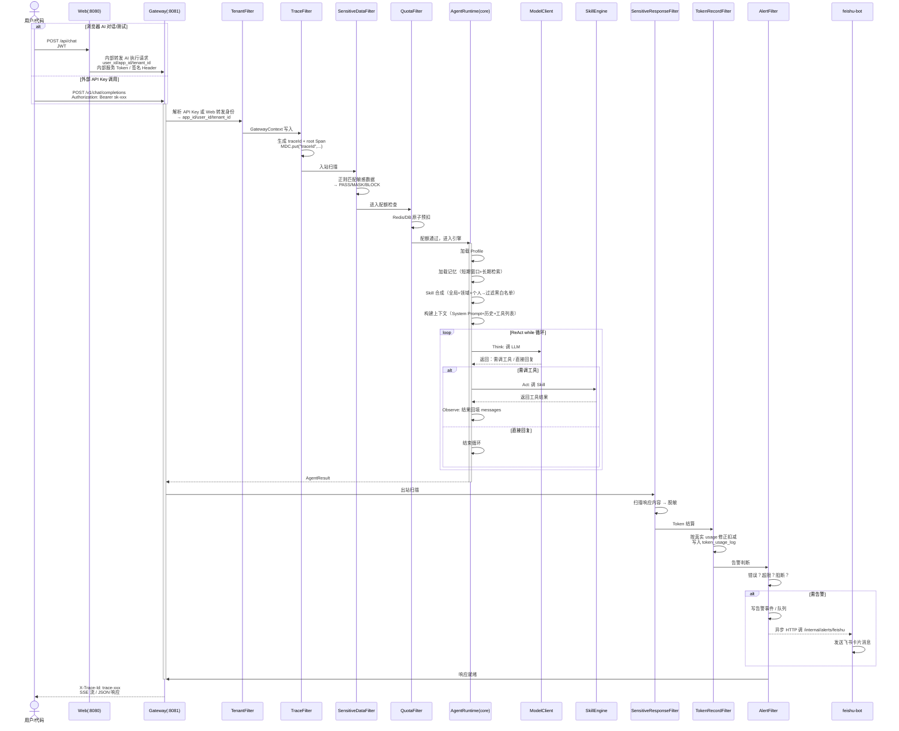
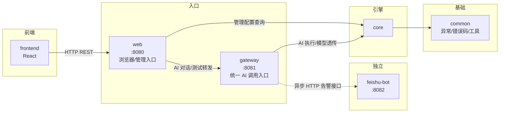
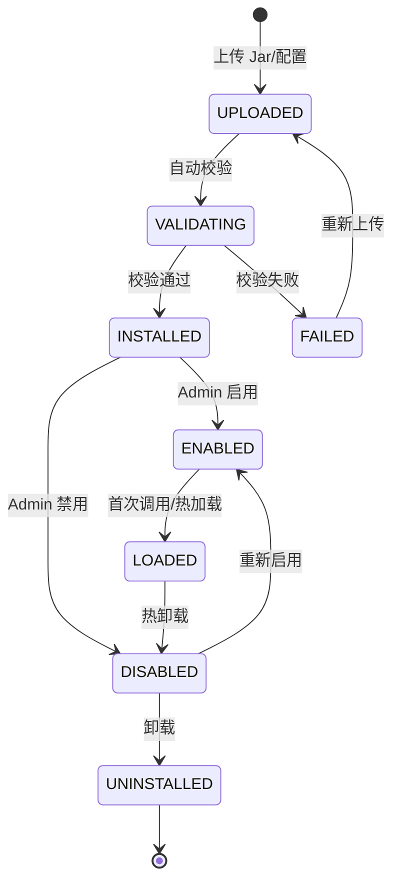

# 系统架构图

> 基于全部设计讨论结论生成，反映 Maven 工程结构、双通道入口、拦截器链、core 内部边界、外部依赖关系。

---

## 1. 系统全景拓扑图

---

## 2. 请求主链路时序图

---

## 3. 模块依赖方向图

**禁止依赖**：core → web、core → gateway、common → 任何业务模块

说明：feishu-bot 是独立服务，不依赖 agent-platform 的 common/core/web/gateway 代码；这里只允许通过 HTTP 告警接口通信。

---

## 4. 拦截器链顺序

```mermaid
graph LR
    A[请求进入] --> B[TenantFilter<br/>租户识别]
    B --> C[TraceFilter<br/>TraceID+rootSpan]
    C --> D[SensitiveDataFilter<br/>入站敏感扫描]
    D --> E[QuotaFilter<br/>Token配额预扣]
    E --> F[RuntimeInvokeFilter<br/>调用 core AgentRuntime]
    F --> G[SensitiveResponseFilter<br/>出站敏感扫描]
    G --> H[TokenRecordFilter<br/>Token结算修正]
    H --> I[AlertFilter<br/>告警条件判断]
    I --> J[响应返回]

    style F fill:#4a90d9,color:#fff
    style B fill:#888
    style C fill:#888
    style D fill:#888
    style E fill:#888
    style G fill:#888
    style H fill:#888
    style I fill:#888
```

全部 Filter 共享 GatewayContext（ThreadLocal），请求结束在 finally 中清理。

---

## 5. Skill 状态流转图

